# 01-clusterip

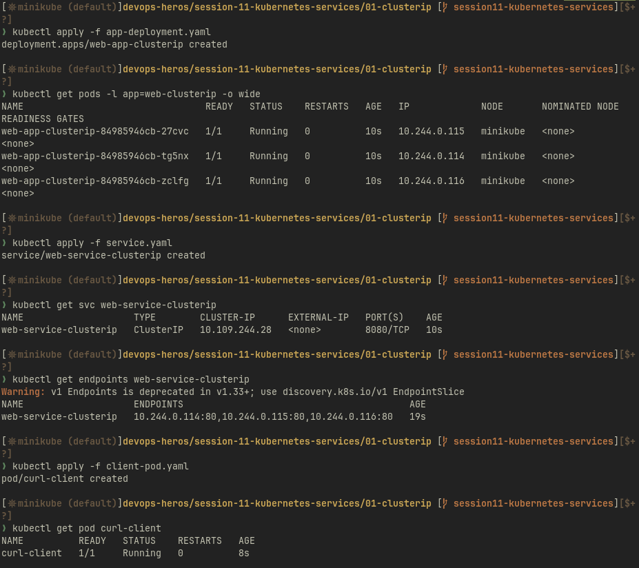
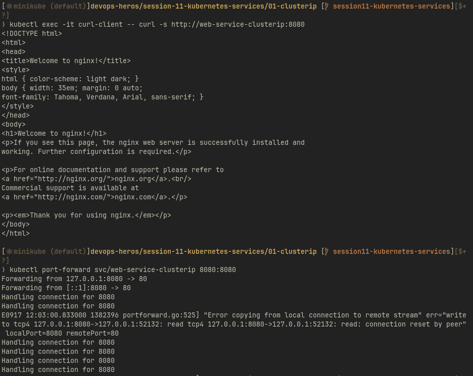
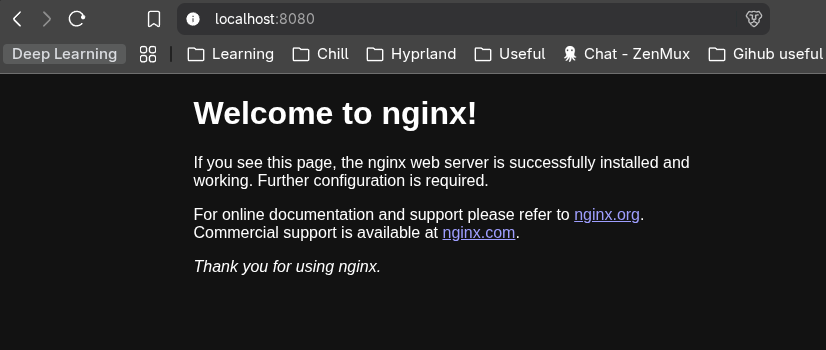

# 02-nodeport

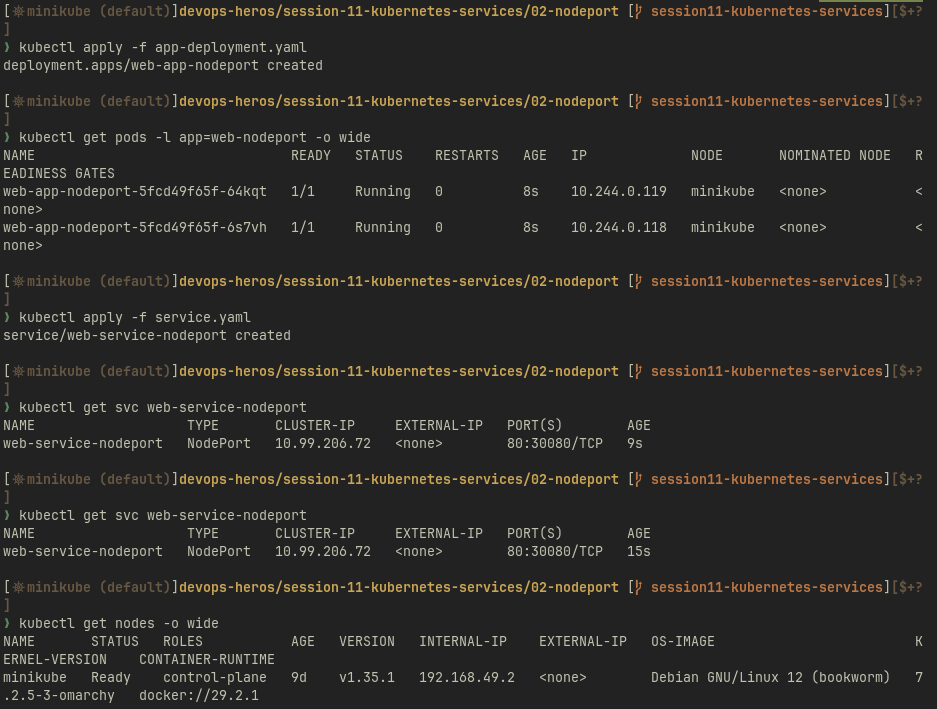
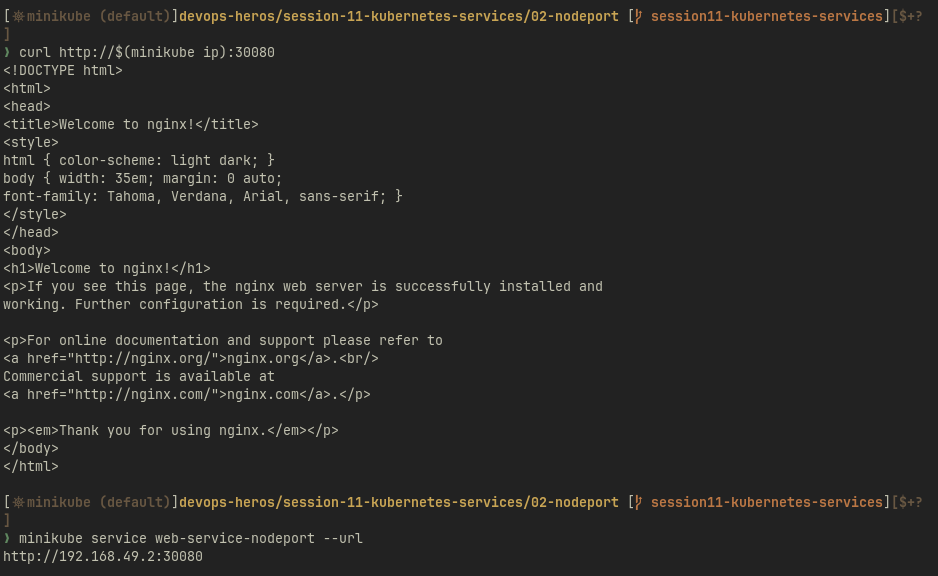
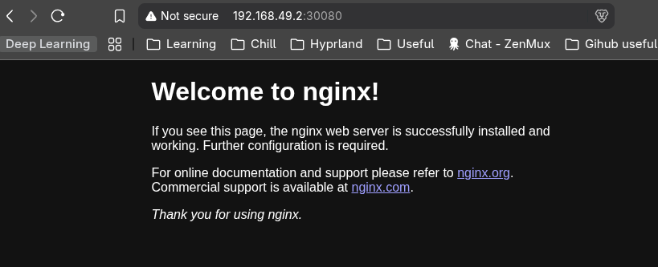

# 03-loadbalancer

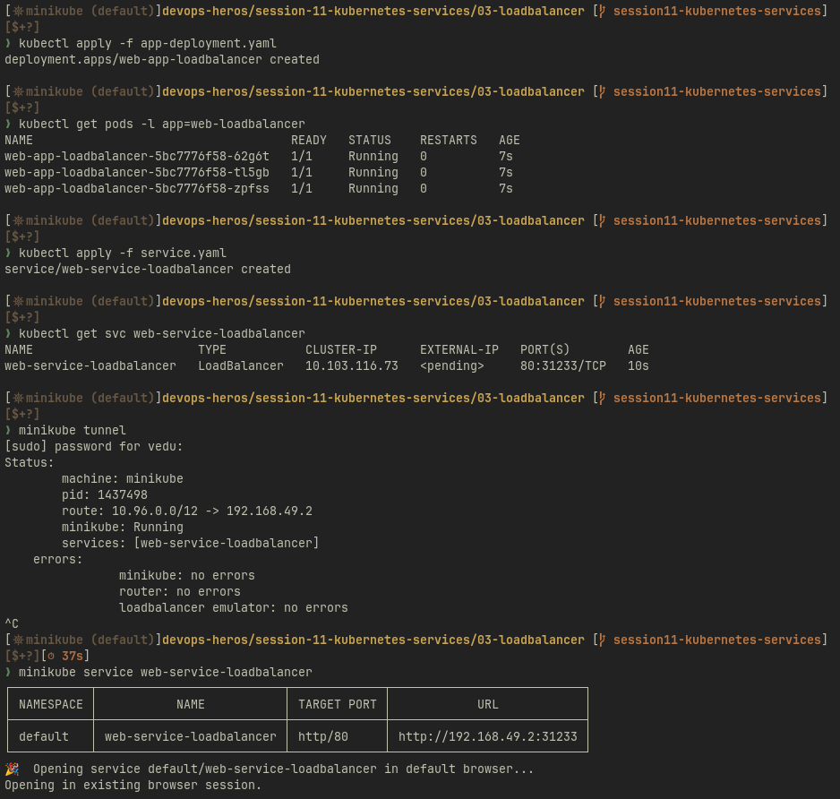
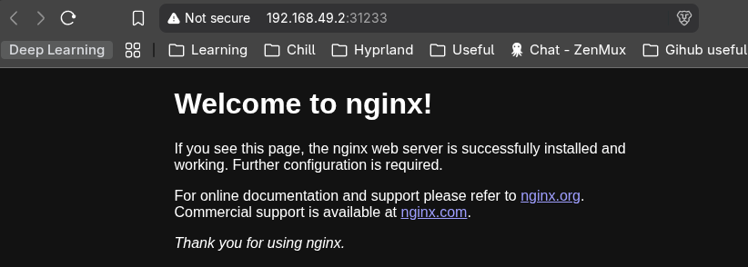

# 04-externalname

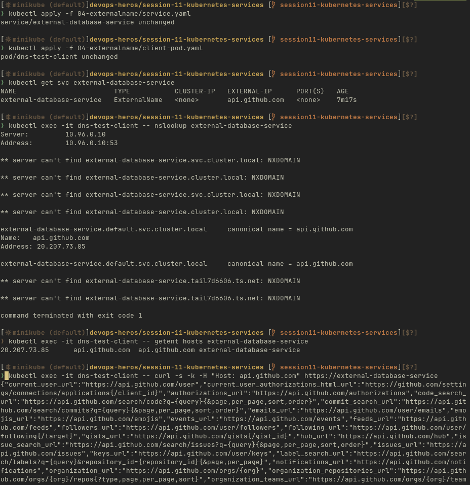

# 05-headless

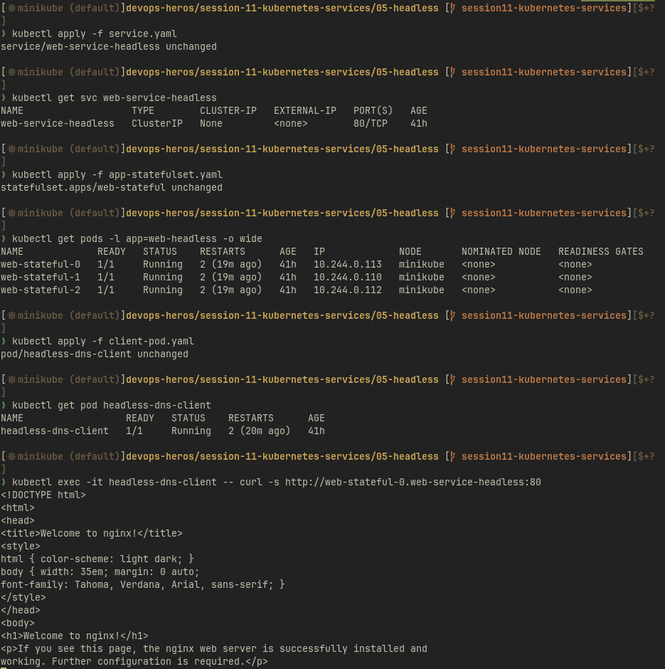

# Task 2: Kubernetes Object Comparison

[Deployment, ReplicaSet, DaemonSet, StatefulSet and Service comparisons](./object-comparisons/README.md)

# Task 3: FQDN

[FQDN, namespace DNS and Pod-to-Service communication](fqdn/README.md)

# Task 4: CoreDNS

[CoreDNS query resolution, configuration and troubleshooting](coredns/README.md)

## DNS hands-on

Executed on 9 October 2026 in the isolated `homework11` namespace. DNS returned the Service ClusterIP and HTTP on Service port 8080 returned the Nginx page. The screenshot includes the backing EndpointSlices and the live CoreDNS configuration.

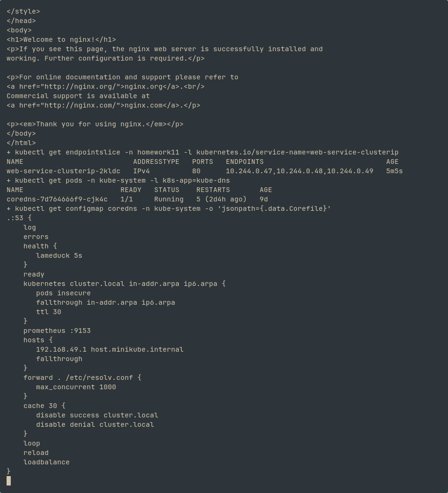
