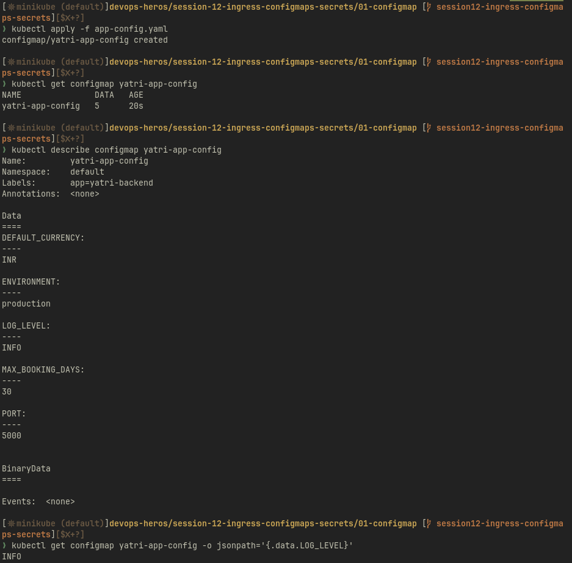
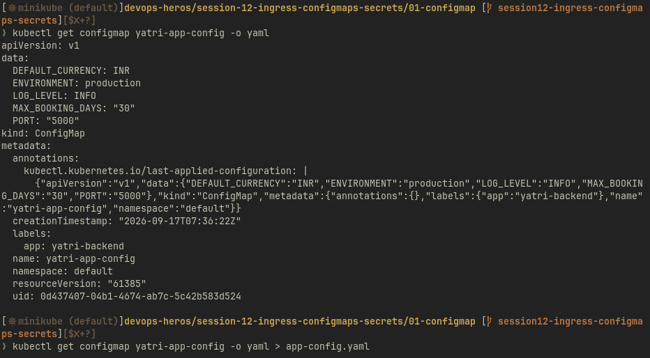
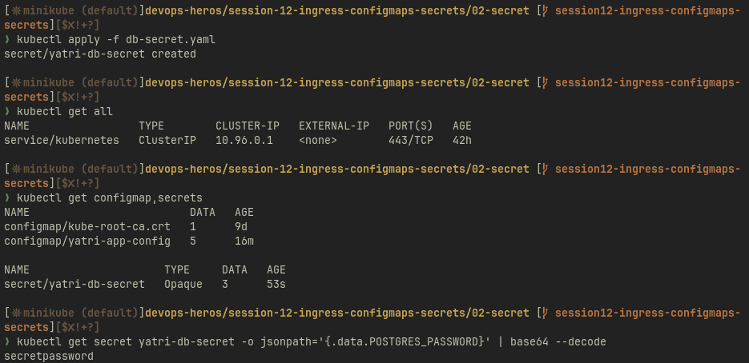
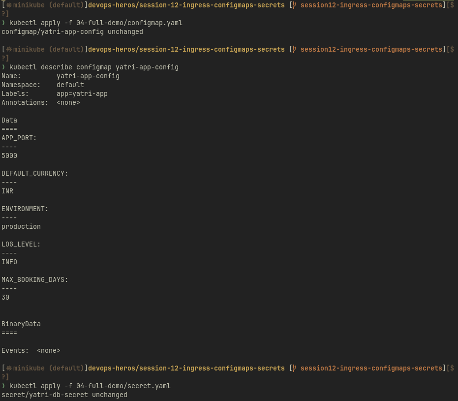
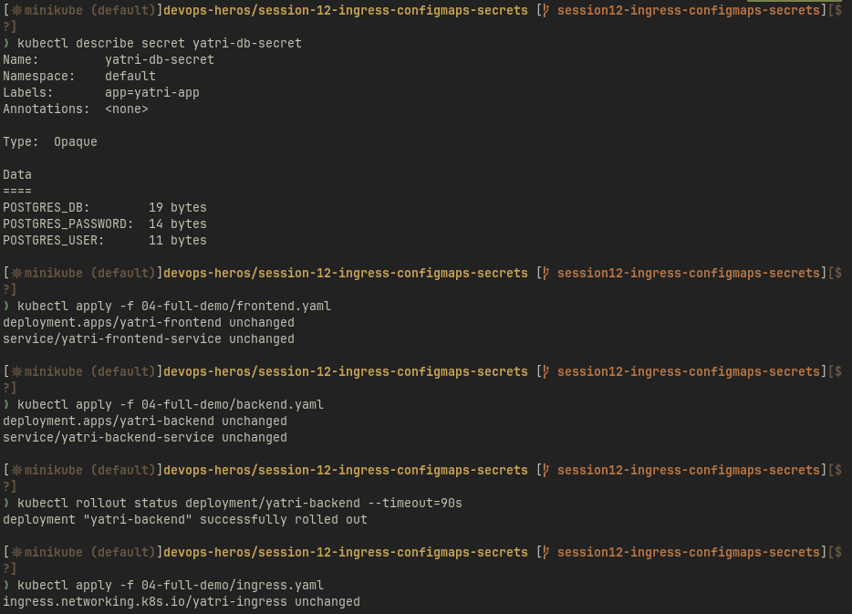
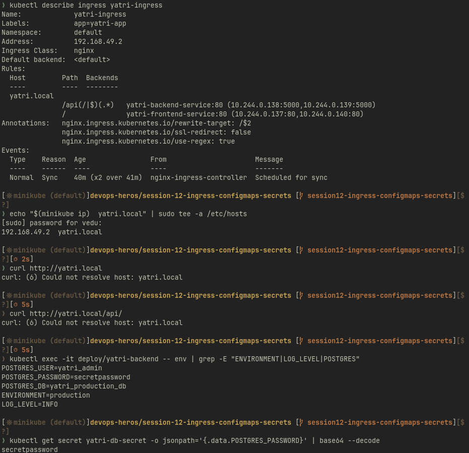
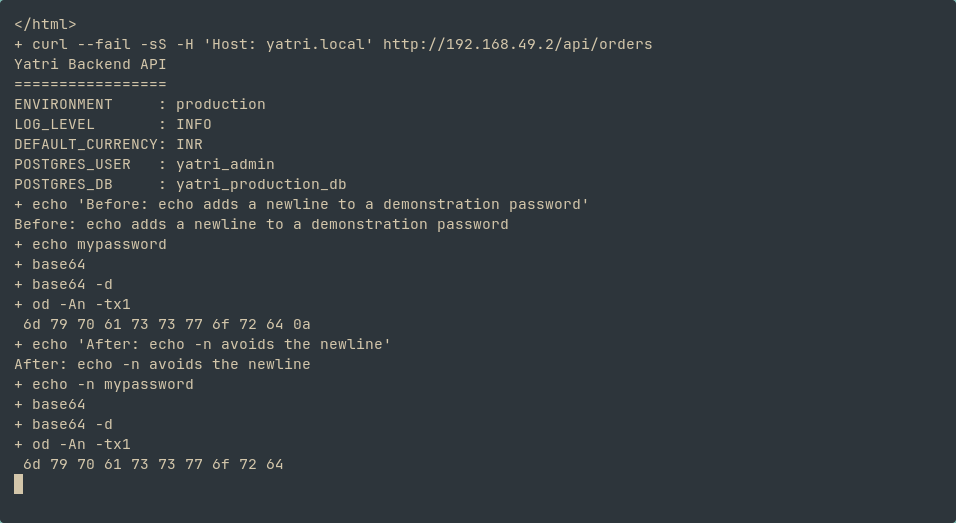

# 01-configmap

# 02-secret

# 04-demo

# Ingress vs Ingress Controller

| Ingress | Ingress Controller |
| :-- | :-- |
| Kubernetes API object containing hostname/path routing rules. | Running software that watches those rules and configures a proxy or load balancer. |
| This lab maps `yatri.local/` to the frontend and `/api` to the backend. | Minikube's `ingress-nginx-controller` implements the routing. |
| Declares the desired routing. | Accepts HTTP traffic and forwards it to Services. |

Creating an Ingress alone does not start a proxy. The matching controller must be installed, ready and selected by `ingressClassName`. Other implementations include Traefik and HAProxy.

# Completed Ingress, ConfigMap and Secret verification

Executed on 9 October 2026. The existing frontend/backend resources were applied, and `curl -H 'Host: yatri.local' http://192.168.49.2/` returned Nginx HTML. `/api/orders` reached the Python API and returned its configured production environment, log level, currency and database username. `kubectl exec` verified the injected variables. Secret verification checks presence without printing its password.

# Troubleshooting: before and after

The [provided troubleshooting exercise](troubleshooting/secret-base64-gotcha.md) concerns a newline in a base64-encoded password. `echo 'mypassword' | base64 | base64 -d | od -An -tx1` ended in `0a`. Replacing `echo` with `echo -n` removed that byte. Both commands were executed and captured above using a disposable demonstration value. The root cause is `echo` appending a newline before encoding. Base64 neither removes it nor encrypts the value.

The first Ingress apply also failed because its admission webhook had just started and refused connections. `kubectl wait -n ingress-nginx --for=condition=available deployment/ingress-nginx-controller --timeout=120s` and reapplying the unchanged Ingress fixed it. Both deployments then rolled out and HTTP verification passed.

Real Secrets, private keys and credential values must stay outside Git. These repository manifests contain teaching values; use runtime-created Secrets or a secret manager for live credentials.
