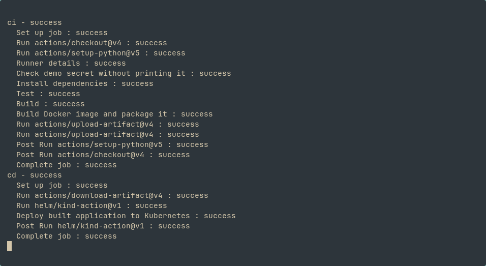
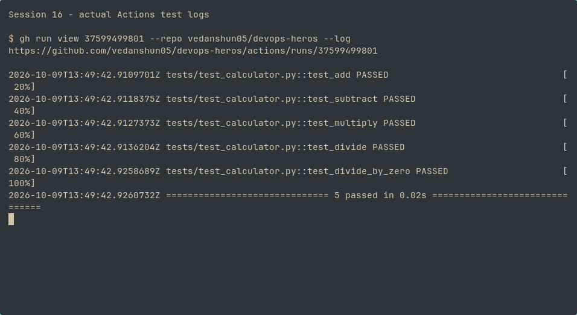
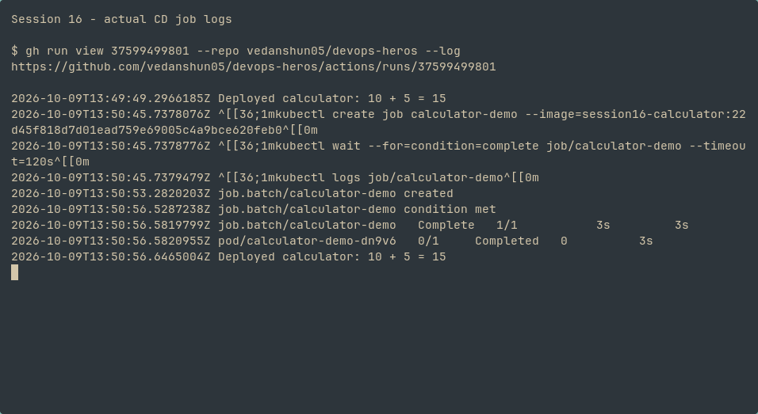

# Session 16: CI/CD & GitHub Actions

**Vedanshu Nishad — 24BCS10285**

The calculator demo passed a real GitHub Actions CI/CD run on 9 October 2026.

[Successful Actions run](https://github.com/vedanshun05/devops-heros/actions/runs/37599499801/attempts/2) · [Application, Dockerfile, tests and pipeline explanation](10-final-cicd-pipeline/README.md) · [Active workflow](../../.github/workflows/session16-ci-cd.yml)

```text
Push → CI: runner → protected secret → 5 tests → build → Docker image
                                                        ↓
                              calculator-build + calculator-image artifacts
                                                        ↓
                   CD: download exact image → Kind → Kubernetes Job → logs
```

## Successful execution

Both `ci` and `cd` passed. `DEMO_SECRET` is stored as a GitHub Actions repository secret and is checked without exposing it. The original failure was an unset secret; configuring it allowed the workflow to run. The existing five tests passed and both artifacts were uploaded. CD ran the built image in a temporary Kind cluster.







The Job completed with `Deployed calculator: 10 + 5 = 15`. This is a real runner deployment; the temporary cluster is removed at the end of the job.
