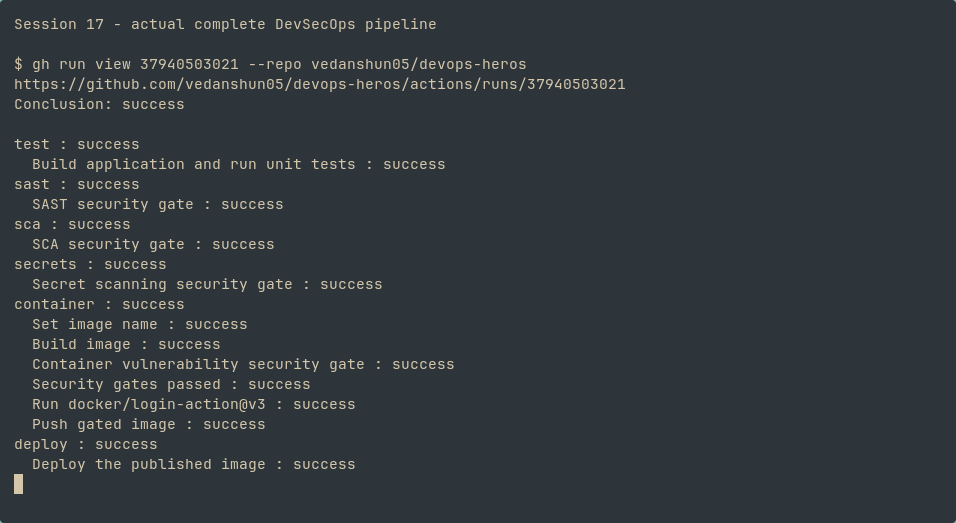
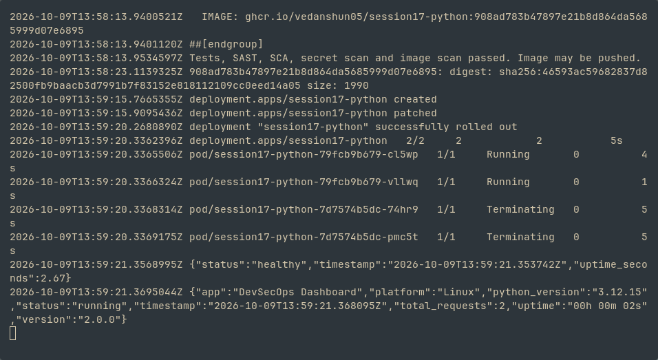

# Tests, SAST and dependency audit


# docker


# security


# Complete CI/CD and DevSecOps pipeline

**Vedanshu Nishad — 24BCS10285**

[Successful real Actions run](https://github.com/vedanshun05/devops-heros/actions/runs/37940503021) · [Active workflow](../.github/workflows/session17-devsecops.yml) · [Application and tests](demo/README.md)

Executed on 9 October 2026. All six jobs passed in order:

```text
Build + unit tests → Bandit SAST → pip-audit SCA → Trivy secret scan
 → Docker build → Trivy HIGH/CRITICAL image gate → GHCR push
 → Kubernetes Deployment + Service → rollout → HTTP health/status checks
```

The original Debian-based image failed the vulnerability gate. I changed the application runtime to `python:3.12-alpine`, rebuilt and scanned it locally, and ran the same remote gates successfully. The container runs as UID 10001. Vulnerability failures still stop the pipeline before publishing; no `continue-on-error` or ignored CVEs were added.



The container job published `ghcr.io/vedanshun05/session17-python:908ad78` (the actual image uses the full commit SHA). CD pulled that image with a runtime Kubernetes registry secret, deployed two replicas and verified `/health` and `/api/status`. Registry credentials are supplied by `GITHUB_TOKEN` and are never committed or printed. The Kind cluster belongs to the temporary Actions runner.



SAST examines source code; SCA checks Python dependencies; secret scanning checks files for credentials; image scanning checks packaged OS and Python libraries. A clean scan means no findings in the configured scan scope and vulnerability database at execution time. It does not guarantee that the application is secure against every possible issue.
