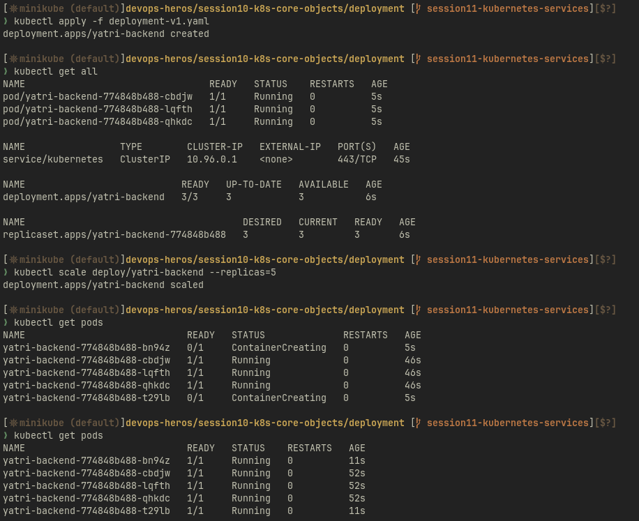
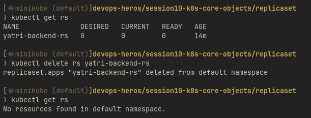
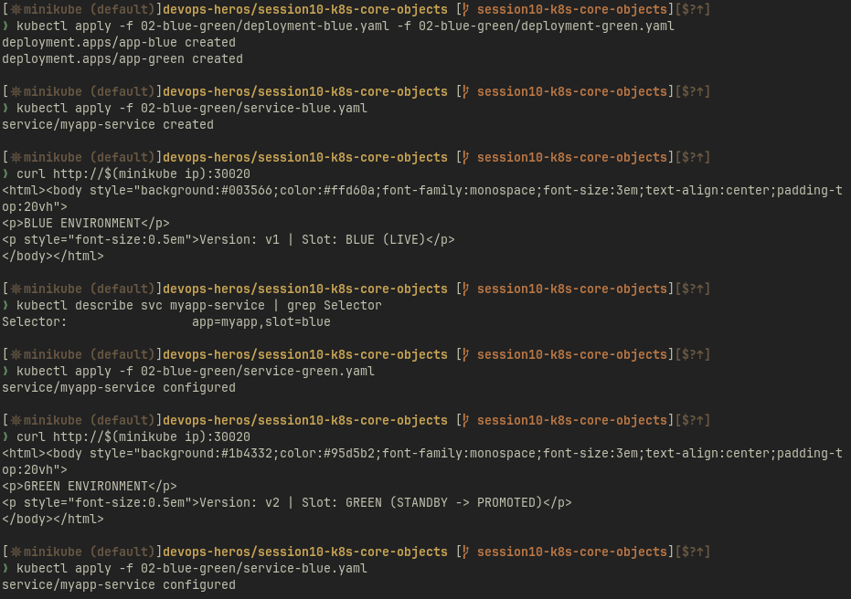
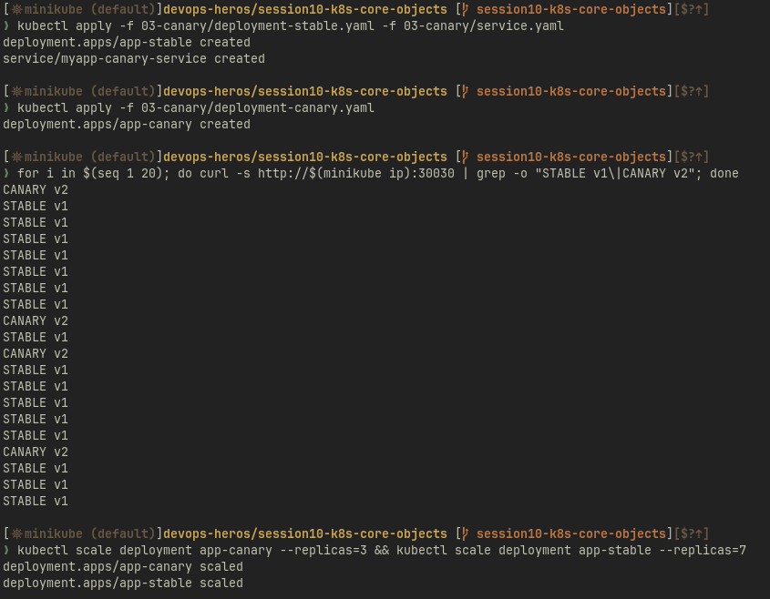
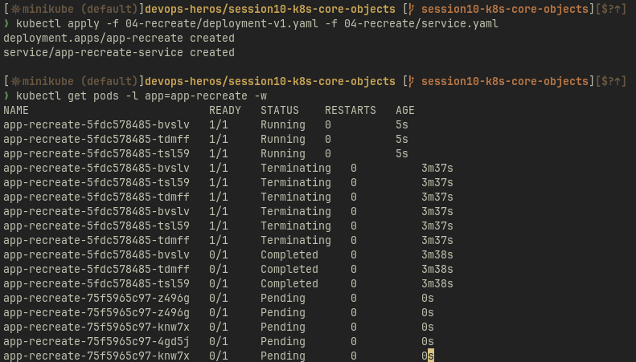
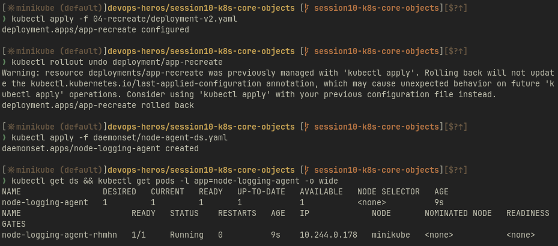
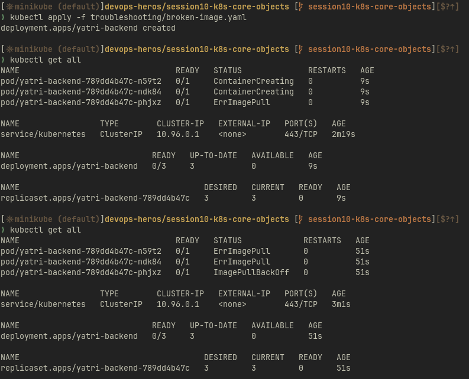
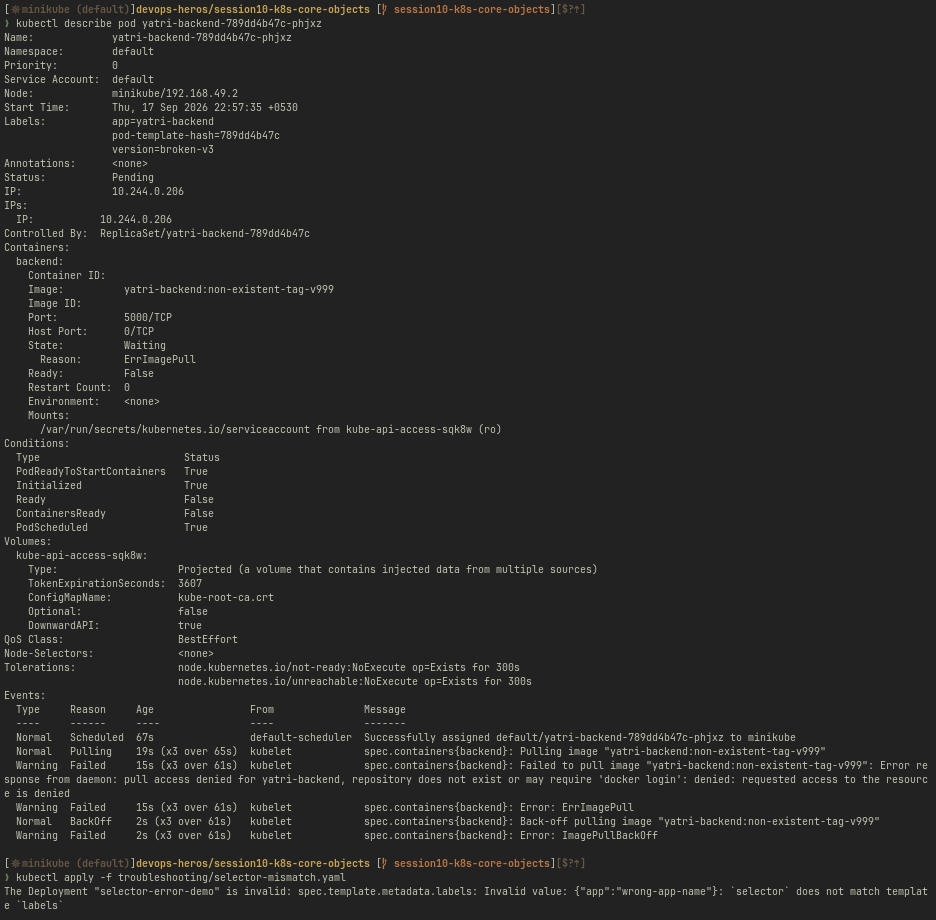

- <https://github.com/Nency-Ravaliya/Kubernetes>

- k8s core objects: <https://github.com/Nency-Ravaliya/Kubernetes/blob/main/core-objects.md>

# Deployment

# Replicaset

# Blue Green

# Canary

# Recreate

# Broken

