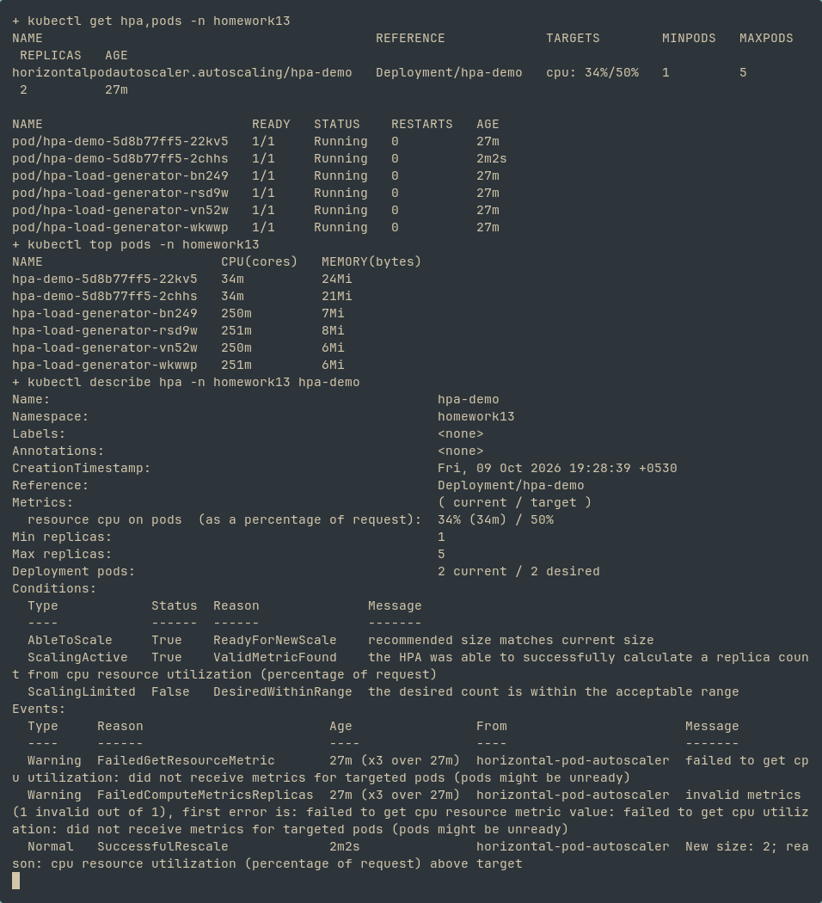

# 01-volumes


# 02-persistent-storage


# 04-hpa


# mini-project


# Task 1: Volume documentation

[emptyDir, hostPath, PV, PVC, StorageClass and dynamic provisioning](01-kubernetes-volumes/README.md)

# Task 2: Executed HPA load generator

[Load-generator Job](04-hpa/load-generator.yaml) sends parallel HTTP requests to the existing Nginx Service. I applied the application, Service, HPA and generator in an isolated `homework13` namespace. `kubectl get hpa`, `kubectl top pods` and `kubectl describe hpa` verified live CPU metrics and replica changes. The initial deployment had one replica; under load the HPA increased it to two.

```bash
kubectl create namespace homework13
kubectl apply -n homework13 -f session13/04-hpa/
kubectl get hpa,pods -n homework13
kubectl top pods -n homework13
kubectl describe hpa -n homework13 hpa-demo
kubectl delete -n homework13 job hpa-load-generator
```



CPU utilization is measured against the container CPU request (`100m`). The HPA targets 50% and is allowed one to five replicas. Removing the generator stops the load; downscaling waits for the stabilization window.
