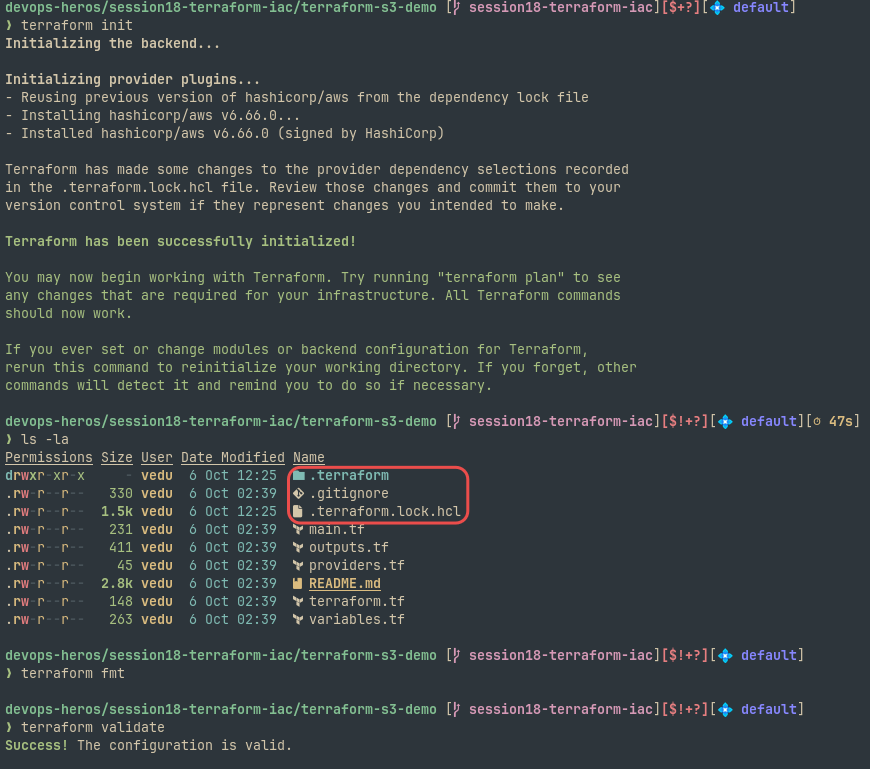
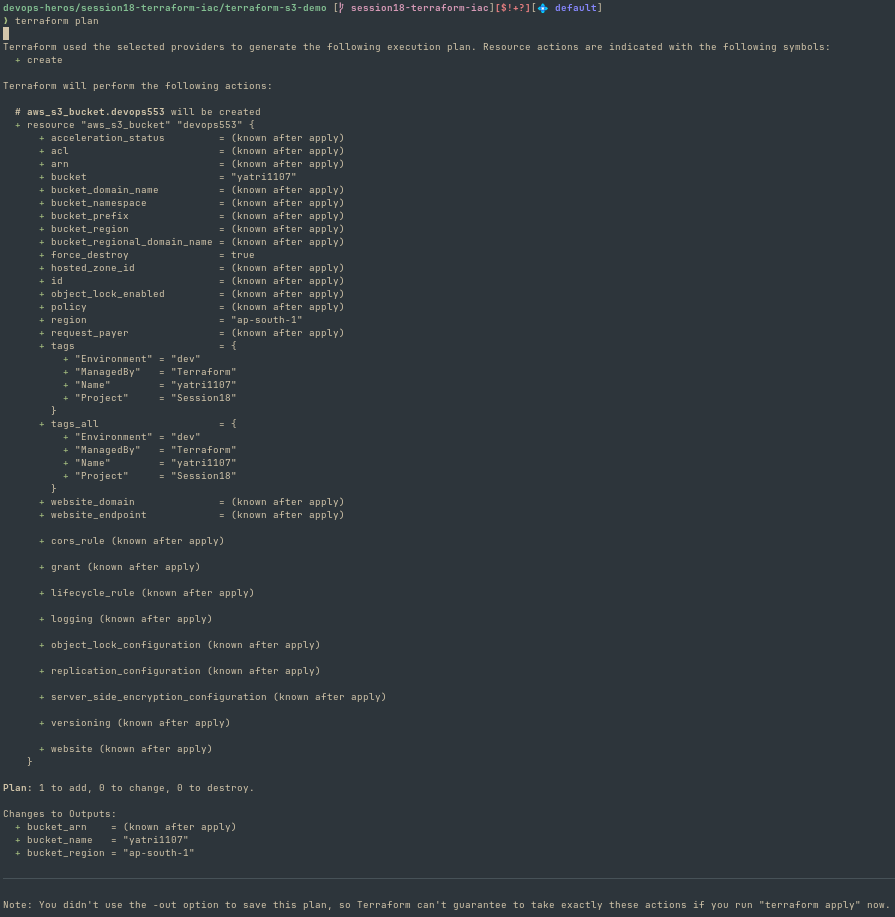
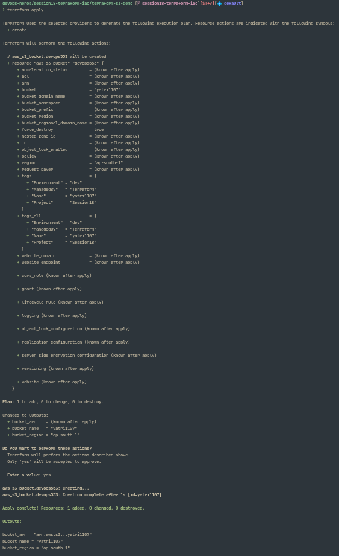
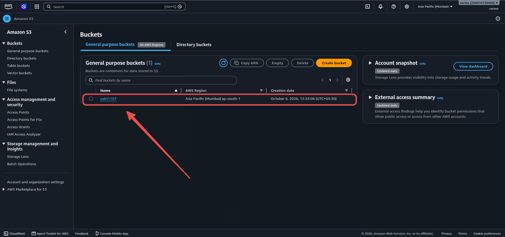
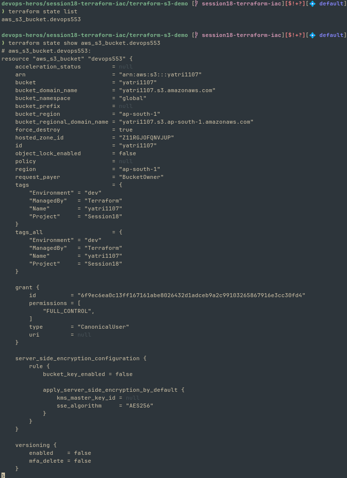
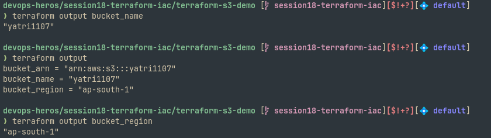
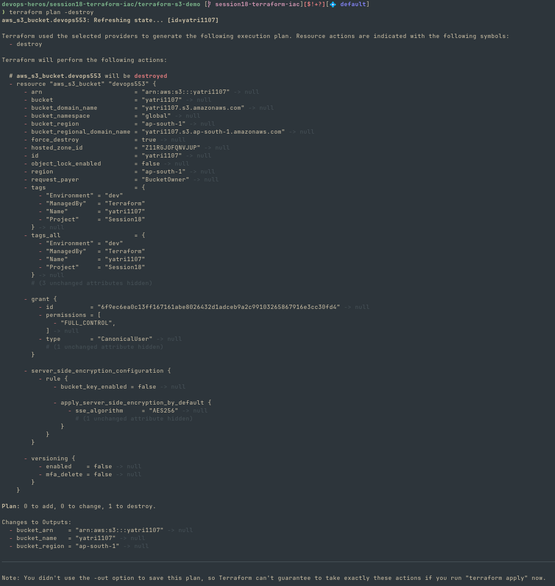
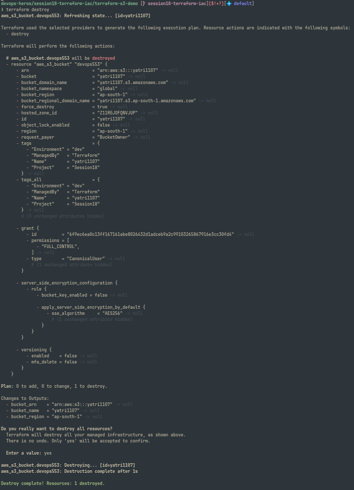

# Install terraform

```
https://developer.hashicorp.com/terraform/tutorials/aws-get-started/install-cli

```

# Terraform with AWS Cloud

```
https://developer.hashicorp.com/terraform/tutorials/aws-get-started/aws-create

```

# Install AWS CLI

```
https://docs.aws.amazon.com/cli/latest/userguide/getting-started-install.html
```

# Terraform S3 Demo










