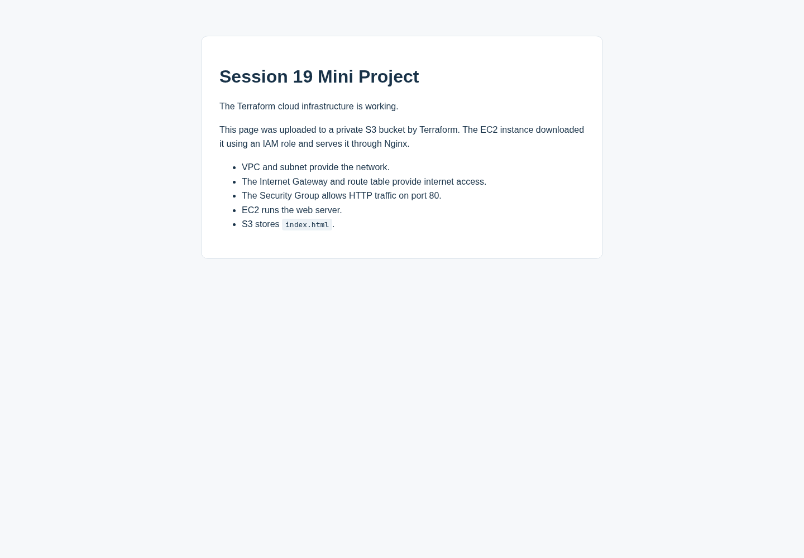

# Session 19 Mini Project — Terraform, EC2, and S3

## What this project does

This project creates a small website using Terraform and AWS.

Terraform uploads `website/index.html` to a private S3 bucket. An EC2 instance downloads that file using an IAM role and serves it with Nginx. We open the page using the instance's public IP address.

The project extends the earlier six-resource networking mini-project. Run its commands from **`08-mini-project`**, which has its own Terraform state.

## Architecture

```text
Terraform creates and manages all the resources below

Mumbai Region: ap-south-1
|
+-- VPC: 10.20.0.0/16
|   |
|   +-- Internet Gateway
|   |
|   +-- Public route table: 0.0.0.0/0 -> Internet Gateway
|   |       |
|   |       +-- Association with the public subnet
|   |
|   +-- Public subnet: 10.20.1.0/24 (ap-south-1a)
|           |
|           +-- EC2: Amazon Linux 2023 + Nginx
|               +-- Public IP -> browser over HTTP, port 80
|               +-- Web Security Group
|               +-- IAM instance profile -> S3 read role
|
+-- Private S3 bucket
    +-- index.html

At startup: EC2 --authenticated HTTPS download--> S3
At runtime: Browser --HTTP--> Internet Gateway --> EC2/Nginx
```

S3 is an AWS service outside this VPC. It is private because its permissions block public access. It is not placed inside the subnet.

The Security Group has the original HTTP/HTTPS rules. Nginx serves **HTTP only** in this lab; opening port 443 does not configure HTTPS or install a certificate. No SSH key or open SSH port is required for startup.

## Project files

| File | Purpose |
| :-- | :-- |
| `versions.tf` | Terraform version, AWS provider version, and provider region |
| `variables.tf` | Region and EC2 instance type inputs |
| `terraform.tfvars.example` | Example input values |
| `main.tf` | VPC, subnet, gateway, route table, association, and Security Group |
| `storage.tf` | Private S3 bucket, encryption, HTTPS policy, and page upload |
| `iam.tf` | EC2 role, permission to read the page, and instance profile |
| `compute.tf` | Amazon Linux AMI lookup and EC2 instance |
| `user-data.sh.tftpl` | Startup script that installs Nginx and downloads the page |
| `website/index.html` | Page stored in S3 and served by EC2 |
| `outputs.tf` | Resource IDs, bucket name, public IP, and website URL |
| `.terraform.lock.hcl` | Provider selection created by `terraform init`; commit this file |
| `.gitignore` | Keeps local state, private variable files, and saved plans out of Git |

## Terraform concepts demonstrated

| Concept | Example from this project |
| :-- | :-- |
| Provider | `hashicorp/aws` connects Terraform to AWS |
| Variables | `aws_region` and `instance_type` |
| Resources | `aws_vpc`, `aws_instance`, and `aws_s3_bucket` |
| Data source | Look up the current Amazon Linux 2023 AMI in AWS Systems Manager |
| Outputs | `website_url`, `instance_id`, and `bucket_name` |
| Implicit dependency | The subnet references `aws_vpc.main.id`, so the VPC is created first |
| Explicit dependency | EC2 waits for the route association, page upload, and read policy |
| State | Local state tracks resource addresses and AWS IDs |
| Plan | Preview changes before creating resources |
| Apply | Create or update resources |
| Destroy | Remove resources managed by this project |

## Before starting

- Terraform and AWS CLI must be installed.
- AWS authentication must work: `aws sts get-caller-identity`.
- Your identity needs permission to manage EC2/VPC, S3, IAM roles and instance profiles, pass the role to EC2, and read the public AMI parameter in Systems Manager.
- Prefer a dedicated lab identity instead of root access.
- This lab uses one `t3.micro`, an encrypted 8 GiB EBS volume, a public IPv4 address, and a small S3 object. These consume AWS usage/credits. Check your account's Free Tier eligibility and destroy the resources after collecting evidence.

If authentication has expired, sign in again with `aws login`. Do not put credentials in Terraform files.

## Step 1 — Open the correct directory

From the repository root:

```bash
cd session19-cloud-terraform/08-mini-project
pwd
```

The printed path must end in `08-mini-project`. Screenshots from `06-terraform-vpc` demonstrate a different lab.

If you already applied this directory, keep its `terraform.tfstate` and use it to extend the existing resources. Do not copy state from `06-terraform-vpc` and do not delete state while its AWS resources still exist.

## Step 2 — Check the variables

Copy the example only if you have not already created `terraform.tfvars`:

```bash
cp -n terraform.tfvars.example terraform.tfvars
cat terraform.tfvars
```

Values for this lab:

```hcl
aws_region    = "ap-south-1"
instance_type = "t3.micro"
```

An existing file containing only `aws_region` also works because the instance type has a default. The startup AMI is x86_64; use a compatible burstable instance such as `t3.micro`.

## Step 3 — Initialize, format, and validate

```bash
terraform init
terraform fmt
terraform validate
```

Expected:

```text
Terraform has been successfully initialized!
Success! The configuration is valid.
```

Initialization creates `.terraform/` and `.terraform.lock.hcl`. Validation checks configuration, but does not prove the website is running.

## Step 4 — Save and review a plan

```bash
terraform plan -out=mini-project.tfplan
```

A fresh deployment has **15 managed resources**:

- 6 networking resources.
- 5 S3 resources: bucket, public-access block, encryption configuration, bucket policy, and page object.
- 3 IAM resources: role, role policy, and instance profile.
- 1 EC2 instance.

Expected for a fresh state:

```text
Plan: 15 to add, 0 to change, 0 to destroy.
```

If the original six networking resources already exist in **this state**, normally expect 9 additions. Review the actual plan rather than assuming the count. The AMI data source is not counted as a managed resource.

IDs marked `(known after apply)` will be generated by AWS during creation.

## Step 5 — Apply the saved plan

```bash
terraform apply mini-project.tfplan
```

This applies exactly the saved plan and does not ask for `yes` again. Apply it only after reviewing Step 4. If you instead run `terraform apply` without a saved plan, review its new plan and enter `yes`.

For a fresh deployment, expect:

```text
Apply complete! Resources: 15 added, 0 changed, 0 destroyed.
```

## Step 6 — Check outputs and state

```bash
terraform output
terraform state list
```

Outputs include:

```text
aws_region = "ap-south-1"
bucket_name = "session19-mini-assets-..."
instance_id = "i-..."
page_s3_uri = "s3://session19-mini-assets-.../index.html"
public_ip = "..."
security_group_id = "sg-..."
subnet_id = "subnet-..."
vpc_cidr = "10.20.0.0/16"
vpc_id = "vpc-..."
website_url = "http://..."
```

`terraform state list` should include the 15 managed resources and the AMI parameter data source. Keep state files private because they can contain sensitive information. Submit the state-list screenshot rather than committing raw state.

## Step 7 — Open the website

```bash
terraform output -raw website_url
curl --fail --show-error "$(terraform output -raw website_url)"
```

The startup script runs after EC2 is created. Give it a few minutes to install Nginx and download the page, then retry if the first request fails.

Open the printed **HTTP** URL in your browser. You should see:

```text
Session 19 Mini Project
The Terraform cloud infrastructure is working.
```

The browser response proves the EC2 server is serving the page downloaded from S3. S3 itself remains private.

## Step 8 — Verify the AWS resources

Use the region output so these queries search the same Region as Terraform:

```bash
LAB_REGION="$(terraform output -raw aws_region)"

aws ec2 describe-vpcs --region "$LAB_REGION" \
  --vpc-ids "$(terraform output -raw vpc_id)" \
  --query 'Vpcs[].{VpcId:VpcId,Cidr:CidrBlock,State:State}'

aws ec2 describe-subnets --region "$LAB_REGION" \
  --subnet-ids "$(terraform output -raw subnet_id)" \
  --query 'Subnets[].{SubnetId:SubnetId,Cidr:CidrBlock,AZ:AvailabilityZone}'

aws ec2 describe-route-tables --region "$LAB_REGION" \
  --filters "Name=tag:Name,Values=session19-mini-public-rt" \
  --query 'RouteTables[].{RouteTableId:RouteTableId,Routes:Routes,Associations:Associations}'

aws ec2 describe-security-groups --region "$LAB_REGION" \
  --group-ids "$(terraform output -raw security_group_id)" \
  --query 'SecurityGroups[].{GroupId:GroupId,InboundRules:IpPermissions}'

aws ec2 describe-instances --region "$LAB_REGION" \
  --instance-ids "$(terraform output -raw instance_id)" \
  --query 'Reservations[].Instances[].{Id:InstanceId,State:State.Name,Type:InstanceType,PublicIP:PublicIpAddress,Subnet:SubnetId}'

aws s3api head-object --region "$LAB_REGION" \
  --bucket "$(terraform output -raw bucket_name)" --key index.html \
  --query '{ContentType:ContentType,Encryption:ServerSideEncryption}'

aws s3api get-public-access-block --region "$LAB_REGION" \
  --bucket "$(terraform output -raw bucket_name)"
```

Expect the VPC to be `available`, the instance to be `running`, the object type to be `text/html`, encryption to be `AES256`, and all four public-access-block settings to be `true`.

In the AWS console, select **Asia Pacific (Mumbai)** for VPC and EC2. Check `session19-mini-vpc`, `session19-mini-web`, and the generated S3 bucket. The database services are not part of this task.

## Step 9 — Collect the screenshots

Save new screenshots in `../Outputs/mini-project/` using these names:

| Screenshot | What it should show |
| :-- | :-- |
| `extended-init-validate.png` | Correct directory, successful init and validation |
| `extended-plan.png` | Plan summary and EC2/S3 additions |
| `extended-apply.png` | Successful apply summary |
| `extended-state-output.png` | State list and outputs including EC2 and S3 |
| `extended-aws-vpc.png` | `session19-mini-vpc` with `10.20.0.0/16` |
| `extended-aws-ec2.png` | Running `session19-mini-web` instance |
| `extended-aws-s3.png` | Private bucket and `index.html` object |
| `extended-website.png` | Page loaded through the EC2 HTTP URL |
| `extended-destroy.png` | Successful destroy summary |

The existing `mini-*` screenshots show the older `06-terraform-vpc` lab. They do not prove this extended project was deployed.

After saving the new images, add Markdown image links here, for example:

```markdown

```

## Step 10 — Destroy after collecting evidence

From the same `08-mini-project` directory:

```bash
terraform plan -destroy
terraform destroy
```

Review the resources and enter `yes`. With all 15 resources still in state, expect:

```text
Destroy complete! Resources: 15 destroyed.
```

Terraform deletes the managed page before deleting its bucket. Do not upload extra objects to the lab bucket: the bucket intentionally does not force-delete untracked data. If it is not empty, remove only your extra lab objects and rerun destroy.

Verify cleanup:

```bash
terraform state list
```

There should be no managed resources left. A data source may still be listed. The separate `06-terraform-vpc` lab is not managed by this state.

## If something fails

| Problem | What to check |
| :-- | :-- |
| AWS CLI returns `[]` | Account, Region, and resource name; use `--region ap-south-1` |
| Missing or expired credentials | Check `aws sts get-caller-identity`; sign in again if needed |
| `AccessDenied` during apply | The deployment identity needs permissions for the specific failed action, including IAM and passing the EC2 role |
| Instance runs but website fails | Wait for startup; check the public IP, route, and inbound TCP 80 rule |
| Browser tries HTTPS | Use the exact `http://` URL; this lab has no TLS certificate |
| S3 object URL gives `AccessDenied` | Expected for unauthenticated access; use the EC2 website URL |
| New plan proposes instance replacement | The latest AMI or page/startup script changed; review before applying |

For startup diagnostics, get the EC2 console output:

```bash
aws ec2 get-console-output --region "$(terraform output -raw aws_region)" \
  --instance-id "$(terraform output -raw instance_id)" --latest \
  --query Output --output text
```

The startup script writes `[INFO]` and `[ERROR]` messages. Instance boot logs can help identify failed package installation or S3 downloads. Logs may not be available immediately.

## Submission checklist

- [ ] Terraform project files and provider lock file.
- [ ] Architecture diagram and explanation of dependencies.
- [ ] Successful plan and apply evidence from `08-mini-project`.
- [ ] AWS console evidence for VPC, EC2, and S3.
- [ ] Browser evidence that the website works.
- [ ] Terraform state and output evidence.
- [ ] Destroy evidence.
- [ ] README and actual screenshots committed; no state, credentials, or plan files committed.

## References

- [AWS: Amazon Linux 2023 AMIs](https://docs.aws.amazon.com/linux/al2023/ug/ec2.html)
- [AWS: AWS CLI v2 on Amazon Linux 2023](https://docs.aws.amazon.com/linux/al2023/ug/awscli2.html)
- [AWS: IAM roles for EC2](https://docs.aws.amazon.com/AWSEC2/latest/UserGuide/iam-roles-for-amazon-ec2.html)
- [AWS: S3 security practices](https://docs.aws.amazon.com/AmazonS3/latest/userguide/security-best-practices.html)
- [AWS: EC2 Free Tier eligibility](https://docs.aws.amazon.com/AWSEC2/latest/UserGuide/ec2-free-tier-usage.html)
- [HashiCorp: Terraform dependencies](https://developer.hashicorp.com/terraform/language/meta-arguments/depends_on)
