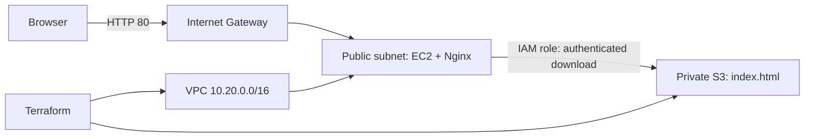
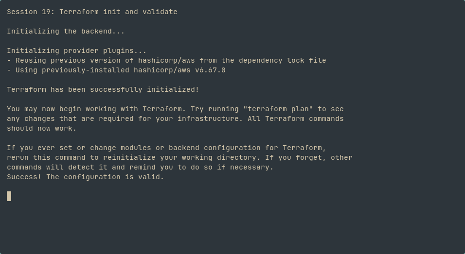
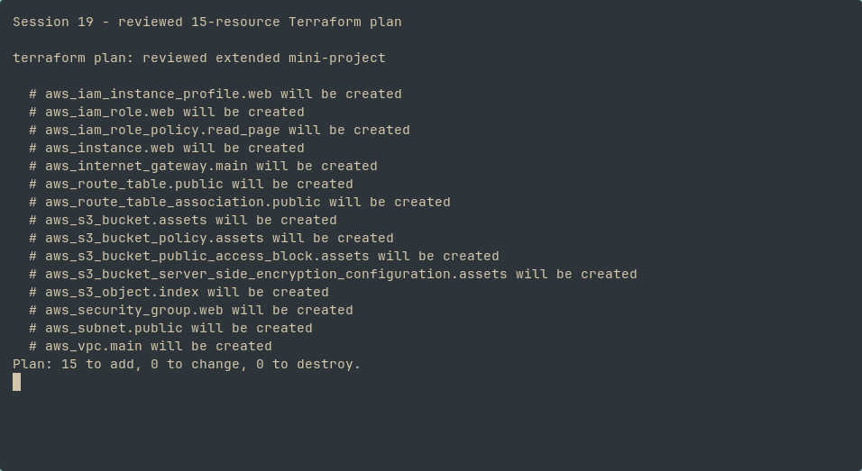
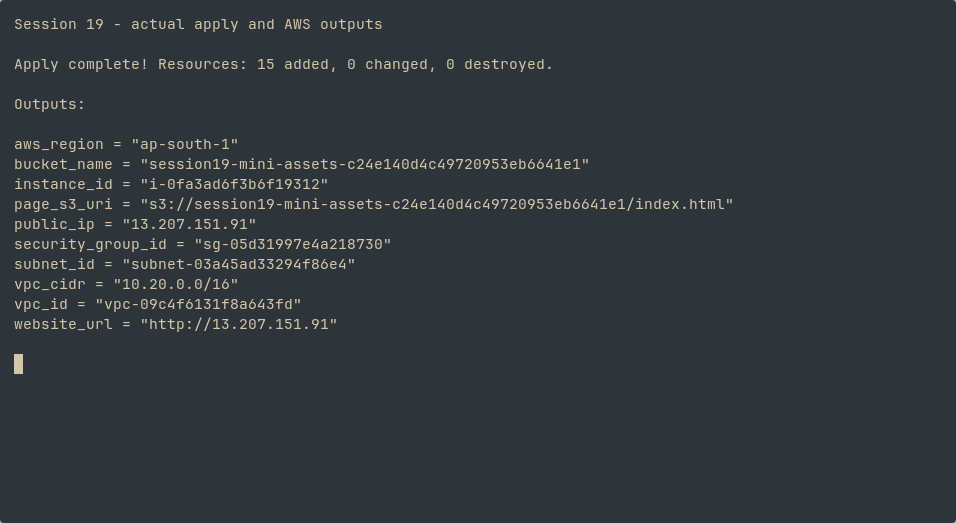
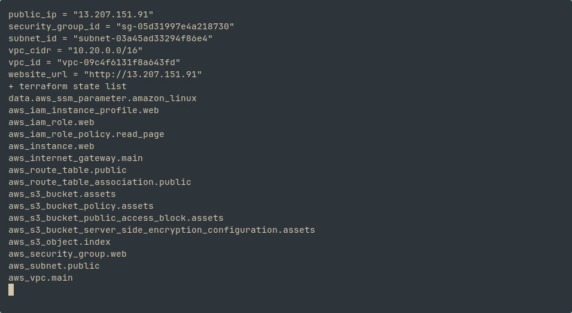
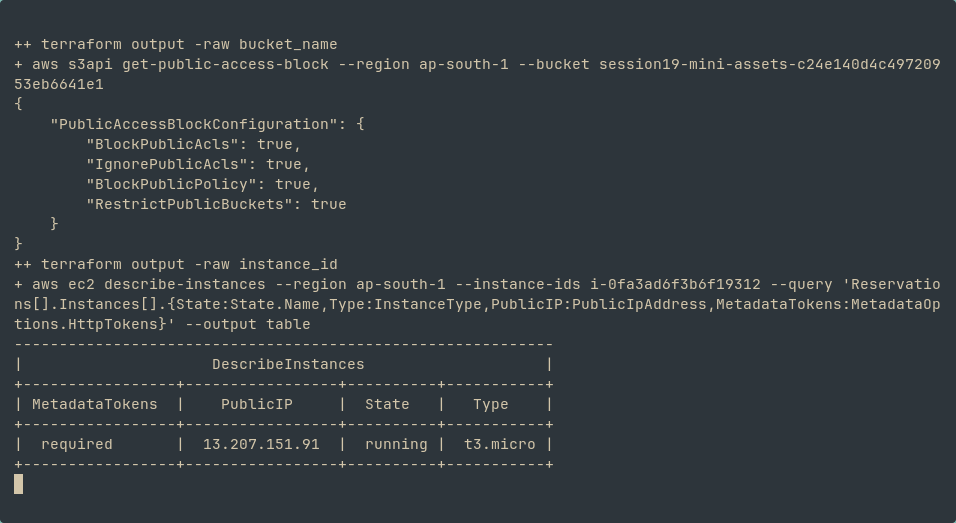
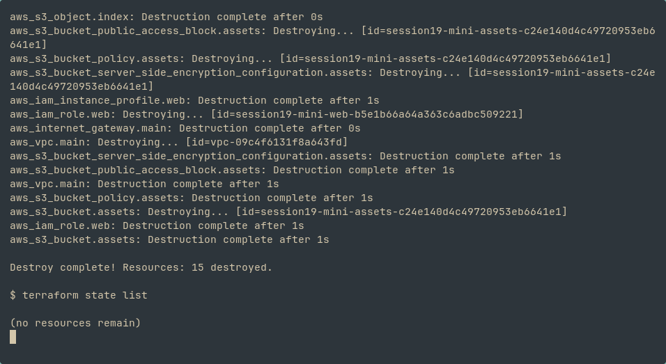

# Session 19 — Cloud and Terraform: completed extended project

The extended [EC2 + private S3 project](08-mini-project/README.md) was applied and verified in Mumbai (`ap-south-1`) on **9 October 2026**, then destroyed. Terraform created 15 resources. EC2 downloaded the website from private S3 through its instance role and served it with Nginx.

| Check | Observed result |
| :-- | :-- |
| VPC | `vpc-09c4f6131f8a643fd`, `10.20.0.0/16` |
| EC2 | `i-0fa3ad6f3b6f19312`, running `t3.micro`, IMDSv2 required |
| S3 | `session19-mini-assets-c24e140d4c49720953eb6641e1`, all four public access blocks enabled |
| Website | HTTP response and browser page at `13.207.151.91` verified before teardown |
| Cleanup | `Destroy complete! Resources: 15 destroyed.`; state list empty |

The address above is historical evidence; the lab is no longer running. Credentials, state and saved plans remain excluded from Git.

The earlier screenshots below document the original networking exercises. The images above prove the extended mini-project separately.

---

# Task

## Plan

## Destroy

