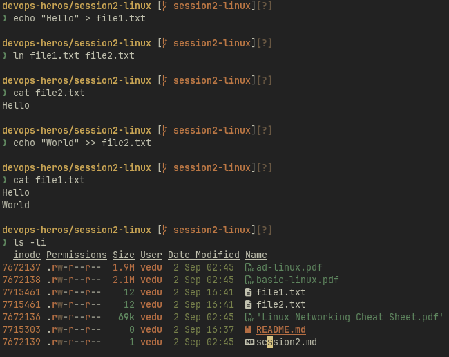
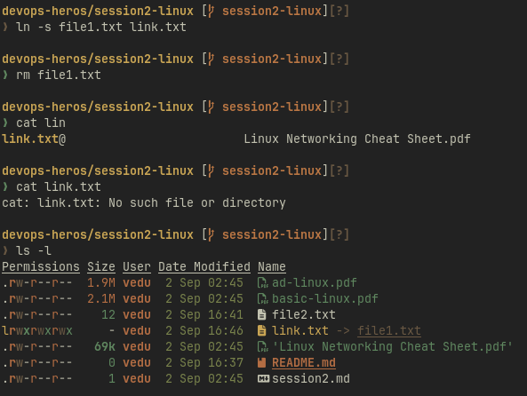
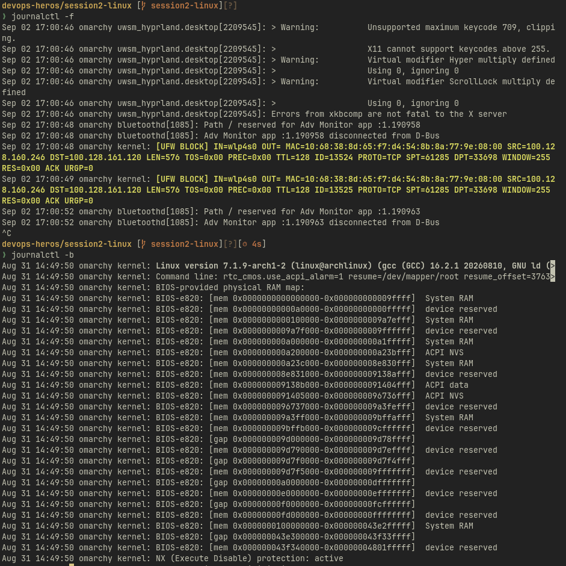

# Task 1: Soft Link & Hard Link

**`Hard Link`** : it is simply another name for the same file

- Both names point to the same inode.
- If we edit either file, both filenames show the updated content.
- If we delete one, the data is not deleted, because file2.txt still points to the inode.
- Only after all hard links are removed does linux free the storage.
  

**`Soft(symbolic) Link`**: it is a special file that stores a path.

- The symlink is just a shortcut, if we open link.txt, linux follows the stored pathname to reach the real file.
- If the original file is deleted, the symlink still exists, but it points to a path that no longer exists. Also called a **dangling** (broken) symlink.
  

# Task 2: adduser vs useradd

**`adduser`** is a user-friendly wrapper
**`useradd`** is the lower-level command

## useradd is more preferred for scripts, Dockerfiles, and automation because it is lower-level, non-interactive, and gives us precise control

# Task 3: journalctl

**`journalctl`**: command-line tool for reading system logs.

