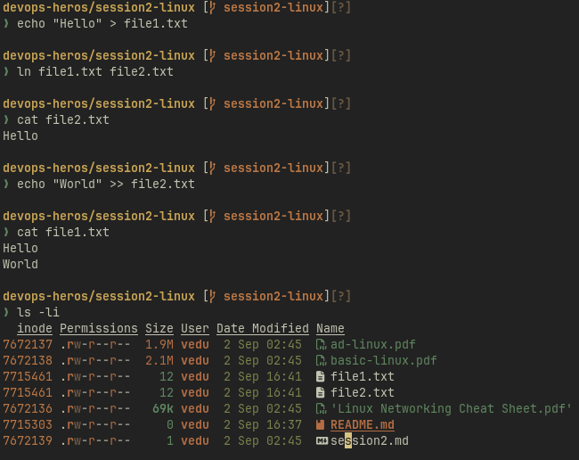
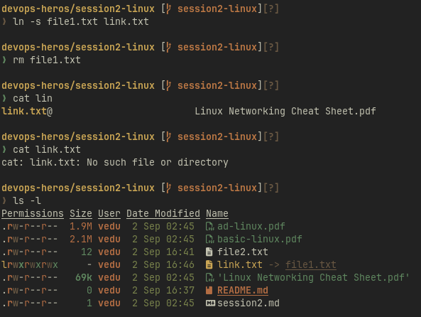
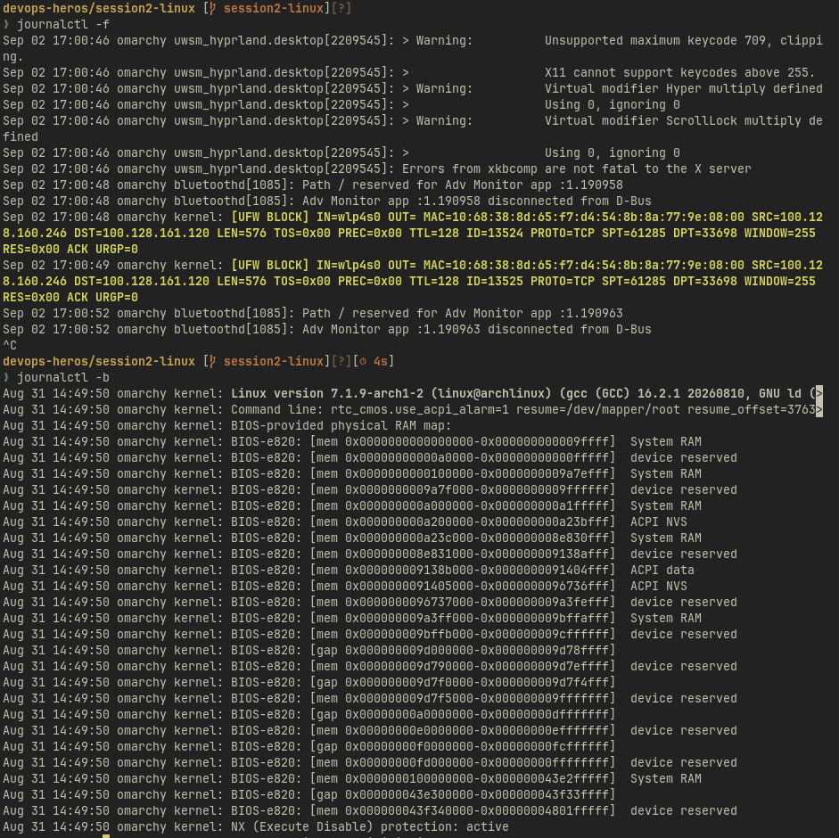
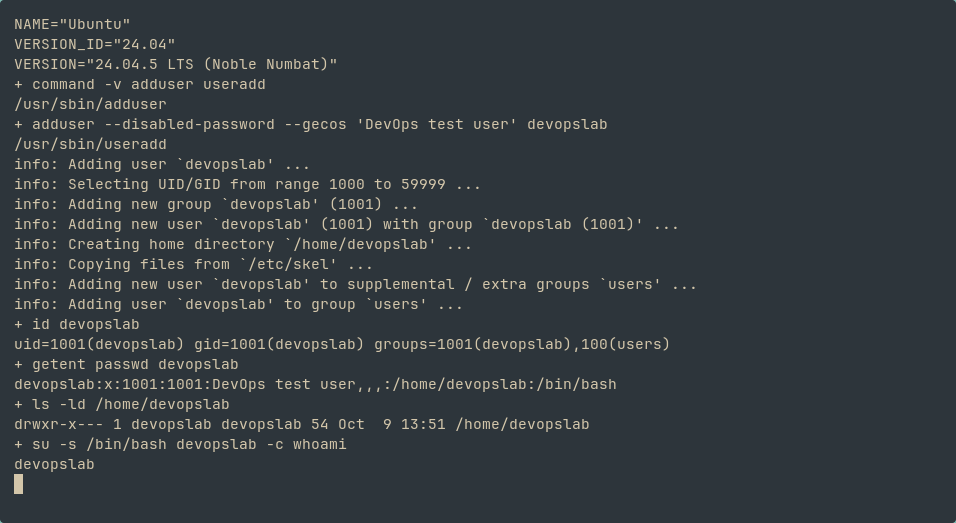
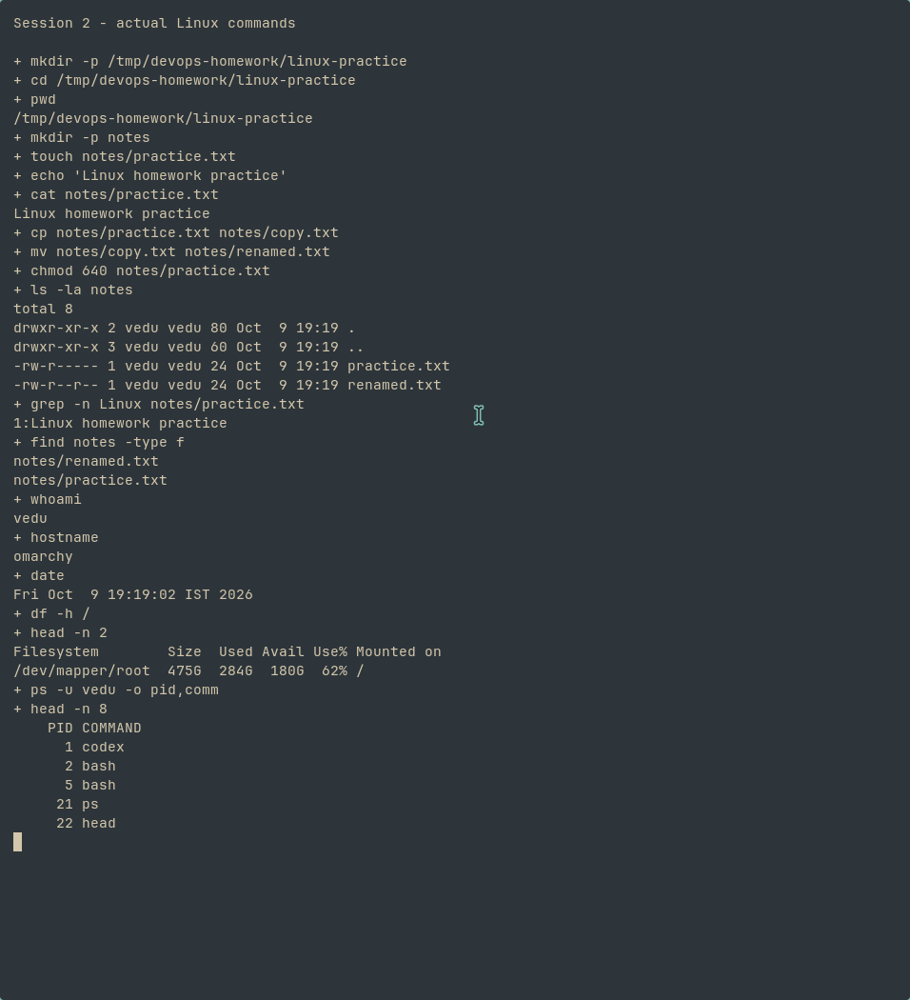
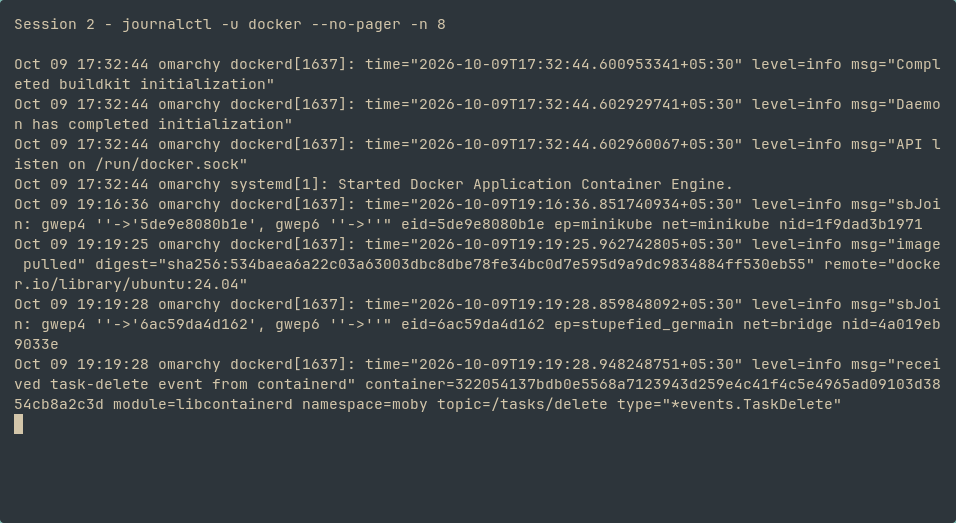

# Task 1: Soft Link & Hard Link

**`Hard Link`** : it is simply another name for the same file

- Both names point to the same inode.
- If we edit either file, both filenames show the updated content.
- If we delete one, the data is not deleted, because file2.txt still points to the inode.
- Only after all hard links are removed does linux free the storage.
  

**`Soft(symbolic) Link`**: it is a special file that stores a path.

- The symlink is just a shortcut, if we open link.txt, linux follows the stored pathname to reach the real file.
- If the original file is deleted, the symlink still exists, but it points to a path that no longer exists. Also called a **dangling** (broken) symlink.
  

# Task 2: adduser vs useradd

**`adduser`** is a user-friendly command on Ubuntu. It prompts for details and
creates a normal user with a home directory. It is the convenient choice for
manually creating a test user on Ubuntu.

**`useradd`** is a lower-level command with explicit options. It is useful in
scripts and automation. For example, `-m` creates a home directory and `-s`
selects a login shell. Defaults and available commands vary by distribution;
on this Arch machine, the manual guide uses `useradd`.

[Source: Ubuntu adduser manual](https://manpages.ubuntu.com/manpages/noble/man8/adduser.8.html).

# Task 3: journalctl

**`journalctl`**: command-line tool for reading system logs.

# Task 4: Linux Command Cheat Sheet

These notes explain the commands used in the remaining practice exercise.
Executed on 9 October 2026; the actual terminal screenshots are below.

| Command | Purpose |
| --- | --- |
| `pwd` | Show the current directory. |
| `mkdir` | Create a directory. |
| `touch` | Create an empty file, or update an existing file's timestamps. |
| `echo` | Print text; `>` writes it to a file and replaces previous contents. |
| `cat` | Display file contents. |
| `cp` | Copy a file. |
| `mv` | Move or rename a file. |
| `ls -la` | List entries, including hidden ones, with details. |
| `chmod 640` | Give the owner read/write access, the group read access, and others no access. |
| `grep -n` | Find matching lines and show their line numbers. |
| `find` | Search directories for matching files. |
| `whoami` | Show the current effective username. |
| `hostname` | Show the machine's hostname. |
| `date` | Show the current date and time. |
| `df -h` | Show filesystem space using readable units. |
| `ps -u "$USER"` | Show processes belonging to the current user. |
| `journalctl -u <service>` | Read journal logs for one systemd service. |
| `id <user>` | Show a user's ID and group membership. |
| `getent passwd <user>` | Look up the user's account entry. |

## Executed test-user exercise

The host is Arch/Omarchy, so I used a disposable `ubuntu:24.04` container for the Ubuntu-specific `adduser` exercise. The minimal Ubuntu image needed the `adduser` package first. `adduser --disabled-password --gecos "DevOps test user" devopslab` created the account, home directory, Bash shell and group membership. `id`, `getent passwd`, `ls -ld /home/devopslab` and `su` verified them. The container was run with `--rm`, so its test account and files were removed when it exited.

## Executed cheat-sheet practice

The screenshot shows file creation, copying, renaming, permissions, text search, filesystem space and processes. `chmod 640` produced `-rw-r-----`; `grep -n` found the text on line 1. Practice files were kept in a disposable directory.

## Service-specific journal logs

`journalctl -u docker --no-pager -n 8` showed Docker startup and container events. `-u` filters one service, `-n` limits the number of entries, `-f` follows new entries, and `--since "1 hour ago"` restricts the time range.

