# Session 21 — LabBoard: Final DevOps Project

**Author: Vedanshu Nishad · Verified: 9 October 2026**

LabBoard is my DevOps homework tracker: create lab tasks, assign priorities, move work through TODO / IN PROGRESS / DONE, and view real task statistics and recent activity. It extends the supplied TaskBoard reference with my own lab domain, UI, tests, security fixes and deployment automation. Existing `taskboard` Helm/resource names are retained for compatibility.

## Verified results

| Area | Evidence |
| :-- | :-- |
| Application | React UI + FastAPI CRUD + PostgreSQL/Alembic working in Docker and Kubernetes |
| Tests | 10 isolated SQLite API tests pass; health, readiness, CRUD, stats, metrics and invalid input covered |
| Containers | Three Compose services run; backend UID 10001 and frontend UID 101; frontend has a multistage build |
| CI/CD | All five jobs passed in [run 37946699543](https://github.com/vedanshun05/devops-heros/actions/runs/37946699543) |
| Security | Bandit, pip-audit, npm audit, secret scan and both HIGH/CRITICAL container gates pass |
| Registry | Both GHCR images published with the full source commit SHA; CI pulls those published images for deployment |
| Kubernetes | Helm release; two frontend and two backend replicas, PostgreSQL StatefulSet/PVC, Services, Ingress, HPA and probes |
| Monitoring | Both backend targets UP; Grafana shows live HTTP requests, memory, CPU and health |
| GitOps | Argo CD Synced/Healthy; Git change scaled frontend 2 → 3; manual drift 3 → 1 healed to 3; Git restored 2 |
| Cloud | VPC + two public subnets + EKS 1.35 Active + one Healthy t3.small worker + two ECR repositories; cleanup recorded below |
| Troubleshooting | Image-pull failure and empty Service endpoints reproduced, investigated, repaired and verified |

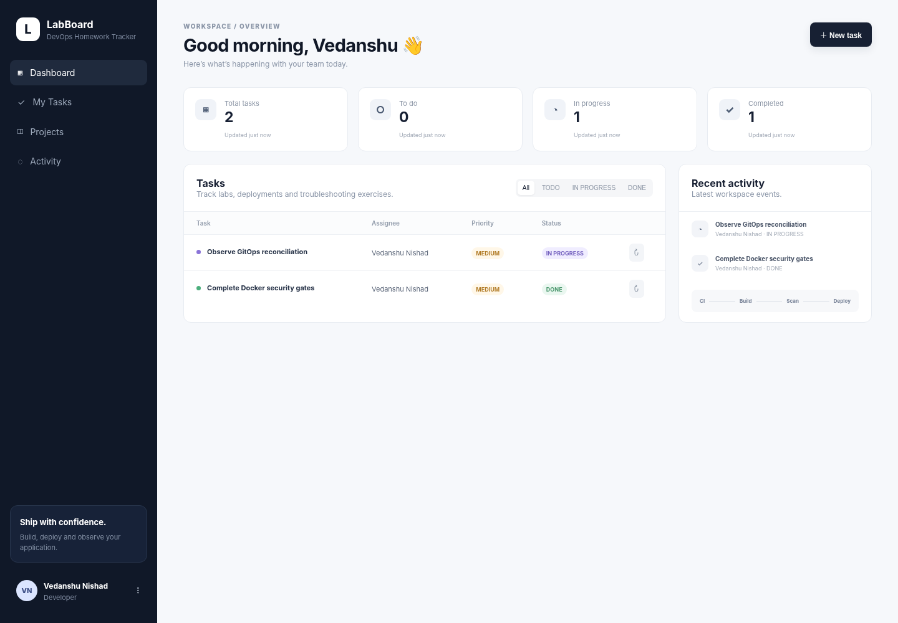

## Architecture and technologies

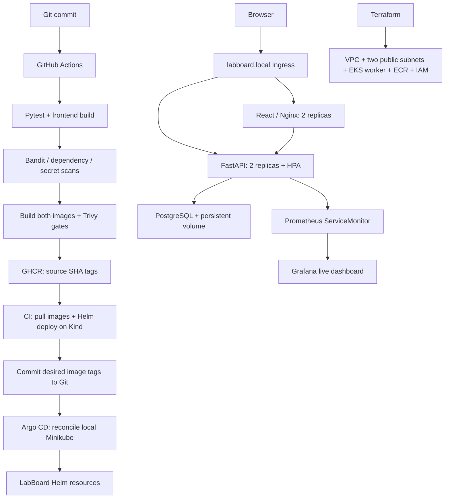
```mermaid
flowchart TD
  Developer[Git commit] --> Actions[GitHub Actions]
  Actions --> Tests[Pytest + frontend build]
  Tests --> Security[Bandit / dependency / secret scans]
  Security --> Images[Build both images + Trivy gates]
  Images --> GHCR[GHCR: source SHA tags]
  GHCR --> Kind[CI: pull images + Helm deploy on Kind]
  Kind --> Promotion[Commit desired image tags to Git]
  Promotion --> Argo[Argo CD: reconcile local Minikube]
  Argo --> Helm[LabBoard Helm resources]
  Browser --> Ingress[labboard.local Ingress]
  Ingress --> Frontend[React / Nginx: 2 replicas]
  Ingress --> Backend[FastAPI: 2 replicas + HPA]
  Frontend --> Backend
  Backend --> DB[PostgreSQL + persistent volume]
  Backend --> Metrics[Prometheus ServiceMonitor]
  Metrics --> Grafana[Grafana live dashboard]
  Terraform --> AWS[VPC + two public subnets + EKS worker + ECR + IAM]
```

The deployment environments are explicit: **CI uses a disposable Kind cluster**, and **the monitored GitOps demo uses Minikube**. AWS infrastructure was provisioned separately and torn down after evidence. This run did not deploy the app to EKS: the available AWS login is root, which cannot assume the EKS operator role. Local Minikube uses images built from the verified source and loaded into its cache; CI independently verifies the exact published GHCR images.

Technologies: Python 3.12, FastAPI, SQLAlchemy, Alembic, PostgreSQL 16, React/Vite, Docker/Compose, GitHub Actions, Bandit, pip-audit, npm audit, Trivy, GHCR, Kubernetes, Helm, Nginx Ingress, Terraform, AWS EKS/ECR/VPC/IAM, Prometheus, Grafana and Argo CD.

## Application and tests

From this session directory:

```bash
python -m venv .venv
source .venv/bin/activate
pip install -r backend/requirements.txt
cd backend
pytest -v
```

Tests create a fresh in-memory SQLite database for each case and override FastAPI's database dependency. They never use the running PostgreSQL database. Production containers apply the Alembic migration before serving requests.

| Endpoint | Purpose |
| :-- | :-- |
| `GET /health` | Process liveness |
| `GET /ready` | Database readiness |
| `GET /metrics` | Prometheus metrics |
| `GET /api/tasks` / `GET /api/tasks/{id}` | List / retrieve tasks |
| `POST /api/tasks` | Create a task |
| `PUT /api/tasks/{id}` | Update a task |
| `DELETE /api/tasks/{id}` | Delete a task |
| `GET /api/tasks/stats` | Dashboard totals |

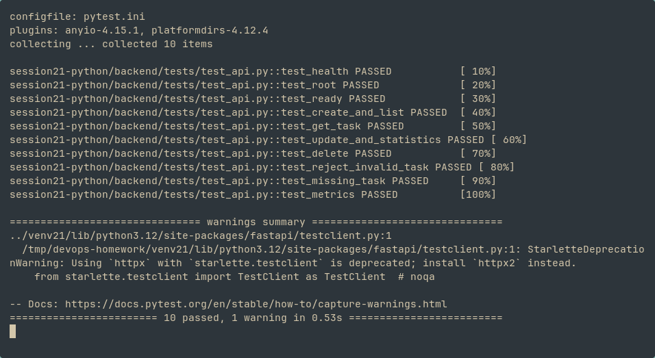

## Docker setup

```bash
docker compose -p session21-homework up --build -d
docker compose -p session21-homework ps
curl --fail http://localhost:3000/health
curl --fail http://localhost:3000/api/tasks/stats
docker compose -p session21-homework exec backend id
docker compose -p session21-homework exec frontend id
```

Open `http://localhost:3000`. PostgreSQL health checks delay backend startup until the database is ready. The Compose password is a disposable local demonstration value; Kubernetes uses a separate generated runtime Secret. The PostgreSQL named volume preserves tasks across container replacement; `docker compose down -v` deliberately removes it.

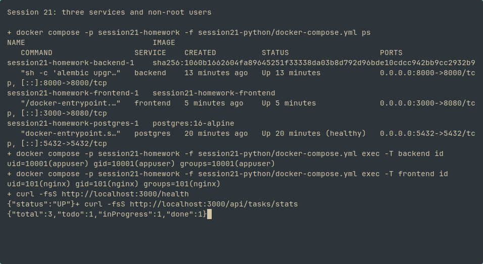


## CI/CD and registry

The active workflow is [`.github/workflows/session21-ci-cd.yml`](../.github/workflows/session21-ci-cd.yml). Its copy inside this session is provided with the coursework; GitHub executes the repository-root workflow. This one root file was explicitly approved as an exception to the session-folder restriction.

Pushes affecting application, chart, Compose or workflow code on **`session21-python`** trigger the pipeline; manual dispatch is also supported. This respects the branch-specific submission design. The reference rubric's `main` trigger is adapted to the submitted branch. Documentation, screenshots and GitOps promotion commits do not cause an image-build loop.

1. **test:** ten API tests and the frontend production build.
2. **security:** Bandit SAST, Python and Node SCA, Trivy secret scanning.
3. **images:** build both images; fail on HIGH/CRITICAL CVEs; push to GHCR using the source SHA.
4. **deploy:** authenticate to GHCR, pull those exact published images, load Kind, create a runtime DB Secret, deploy Helm and verify health/task API through the frontend proxy.
5. **gitops:** promote the verified image tags in `gitops/values.yaml` with a bot commit.

Verified source: `0760dda471aaf010996527177f6966506dff4ade`.

- `ghcr.io/vedanshun05/labboard-backend:0760dda471aaf010996527177f6966506dff4ade`
- `ghcr.io/vedanshun05/labboard-frontend:0760dda471aaf010996527177f6966506dff4ade`

GHCR packages may require authentication. CI uses job-scoped `GITHUB_TOKEN` permissions; a separate cluster pulling private packages needs an `imagePullSecret` with package read access. Credentials are supplied at runtime and are not stored in this repository.

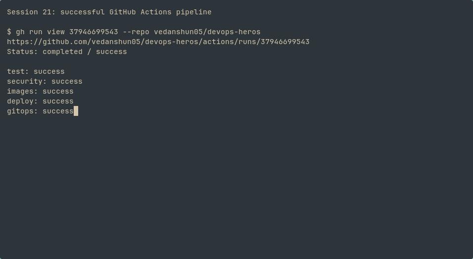
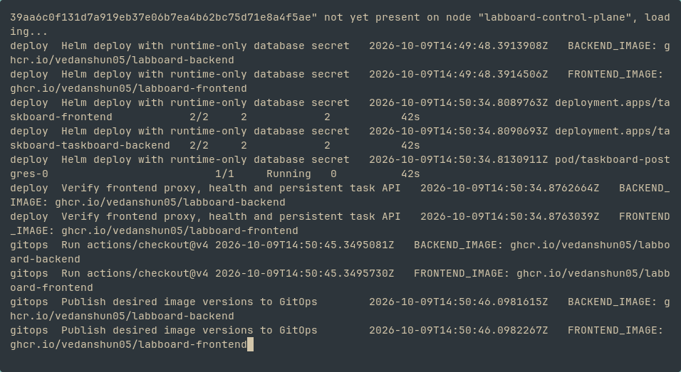
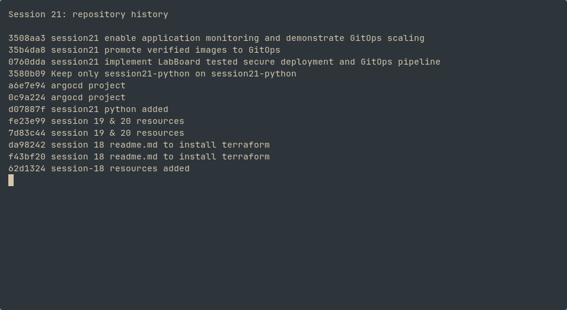

## DevSecOps results

The original Python dependency graph contained vulnerable dependencies, and the original frontend image failed its gate. The final dependency lock, Alpine backend and updated unprivileged Nginx runtime passed SCA and container gates. A custom `prometheus_client` middleware replaces the old metrics wrapper so the app can use the repaired dependency graph.

Trivy scanned OS packages and application dependencies in both images. The CI result was **zero HIGH/CRITICAL findings** at scan time, with `exit-code: 1` configured for failures. This result describes that severity gate and database snapshot; it is not a claim that future vulnerabilities cannot appear.

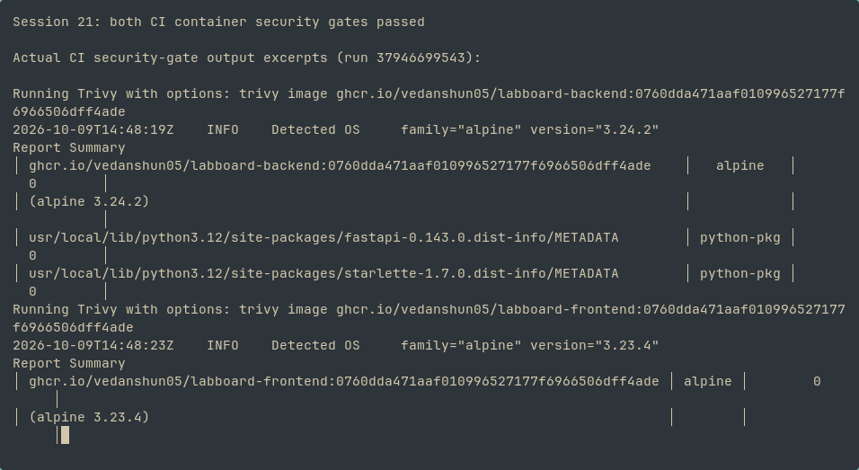

## Kubernetes and Helm deployment

The chart is [helm/taskboard](helm/taskboard). It creates Deployments, ClusterIP Services, a ConfigMap, a PostgreSQL StatefulSet/PVC, optional Ingress, backend HPA, probes and optional ServiceMonitor. Namespace bootstrap is [k8s/namespace.yaml](k8s/namespace.yaml).

```bash
minikube start
minikube addons enable ingress
minikube addons enable metrics-server
kubectl apply -f k8s/namespace.yaml
LAB_DB_PASSWORD="$(openssl rand -hex 24)"
kubectl create secret generic taskboard-postgres -n taskboard   --from-literal=username=taskboard --from-literal=password="$LAB_DB_PASSWORD"
unset LAB_DB_PASSWORD
# Load matching locally built images into Minikube, or configure GHCR pull access.
helm upgrade --install taskboard helm/taskboard -n taskboard   -f gitops/values.yaml --wait --timeout 5m
kubectl get pods,svc,pvc,ingress,hpa -n taskboard
helm list -n taskboard
curl --fail -H 'Host: labboard.local' "http://$(minikube ip)/api/tasks/stats"
```

For browser access, map `labboard.local` to the Minikube IP in your local DNS/hosts configuration. The screenshot was captured with a browser host-resolution rule, without changing system configuration. Ingress sends `/` to the frontend and `/api` to backend port 8000. Nginx also proxies API and health requests to the backend Service.

The backend has startup, readiness and liveness probes, CPU/memory requests and limits. HPA targets 60% CPU and keeps 2–6 replicas. Argo CD ignores the backend's replica field so HPA and GitOps do not fight each other.

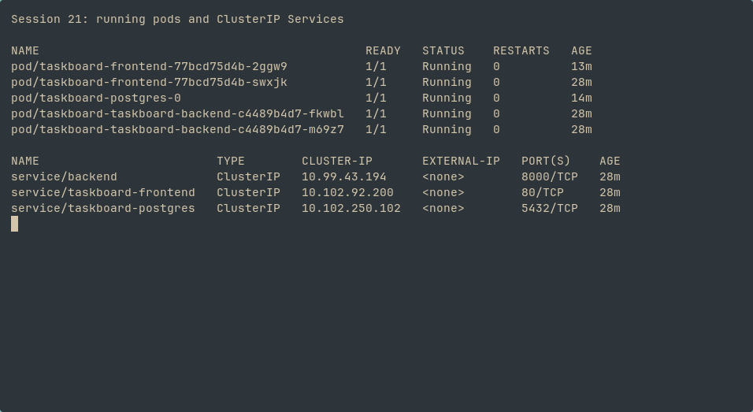
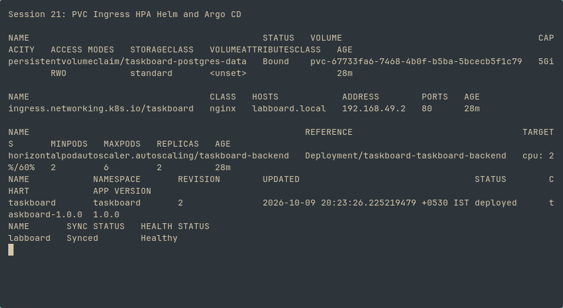

A task was created, the PostgreSQL pod deleted, and the same task read after the replacement pod became Ready. Its ID and content persisted on the Bound 5 GiB PVC.

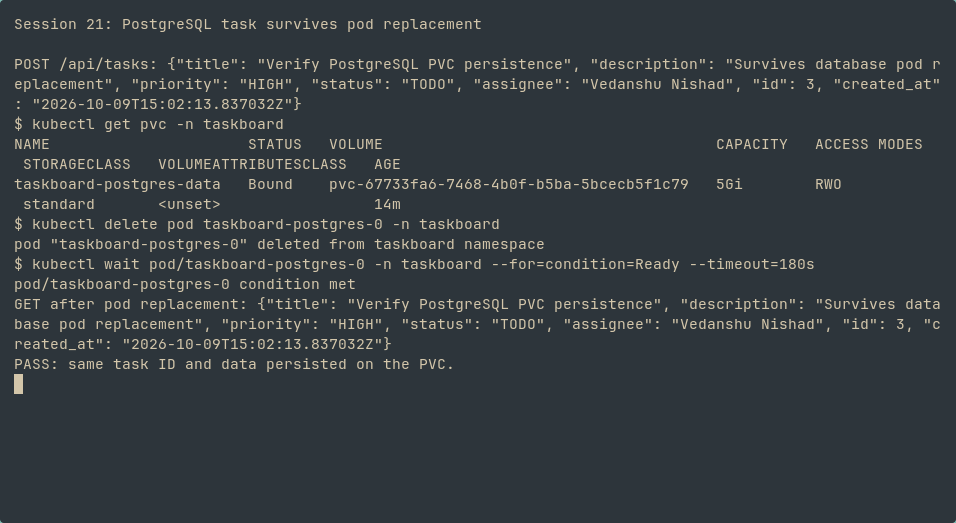

## Terraform and AWS infrastructure

The [terraform directory](terraform) contains valid HCL, pinned VPC/EKS module versions, provider constraints and an example variable file. It provisions a VPC with two public subnets, one managed EKS worker, API access restricted to the operator's IP, ECR repositories, EBS CSI/IRSA and supporting IAM/KMS resources. EBS CSI uses one controller replica and creates the default StorageClass for this single-worker lab. The lab has no NAT gateway. Public-subnet workers are a short-lived lab choice.

```bash
cd terraform
aws sts get-caller-identity
terraform init
terraform fmt -check
terraform validate
# Supply your own current public IPv4 CIDR, not the documentation example.
terraform plan -var='allowed_cidrs=["YOUR_PUBLIC_IP/32"]' -out=lab.tfplan
terraform apply lab.tfplan
terraform output
# After evidence, destroy using the same state and inputs.
terraform destroy -var='allowed_cidrs=["YOUR_PUBLIC_IP/32"]'
terraform state list
```

The fresh plan contained 56 Terraform resources. AWS rejected the original `t3.medium` node because this account restricts launches to Free Tier eligible types. Querying `describe-instance-types` identified `t3.small`; Terraform replaced the failed node group with one eligible worker. The final node group was Active, with no health issues, and EC2/Auto Scaling showed its instance running and Healthy.

After the live checks were saved, deletion of the verified worker was started while AWS finished deleting the failed original worker group. The failed group's empty Auto Scaling group was also removed to stop unsuccessful launch retries. Terraform state was retained throughout, and final cleanup was continued from that state. AWS held the worker in a termination lifecycle wait; its lab EC2 instance was terminated directly after verification.

The first apply also lost credentials while EKS was being created. After verifying that AWS had created an Active cluster, Terraform's tainted state was reconciled, and a credential process refreshed short-lived credentials during the long operation. Credentials, saved plans, state and caches are excluded from Git.

AWS evidence below is from actual CLI/API responses, rather than console screenshots. An IAM user/role with permission to assume the operator role is required for `aws eks update-kubeconfig --role-arn`; root credentials cannot assume it. No IAM user or permanent access key was created for this homework.

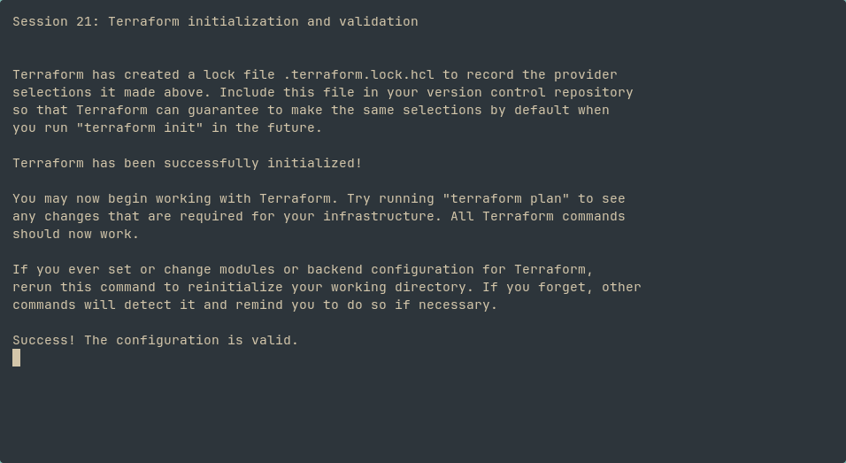
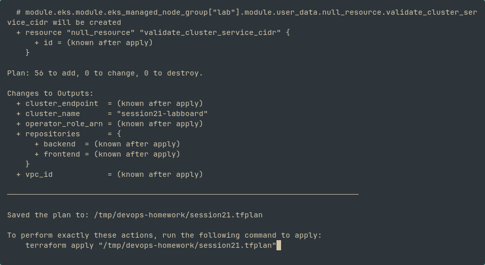
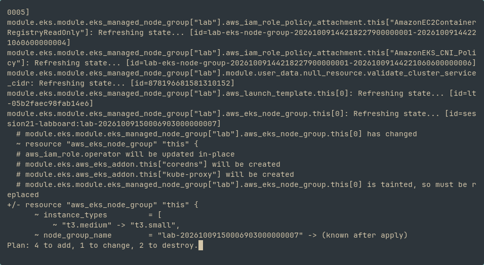
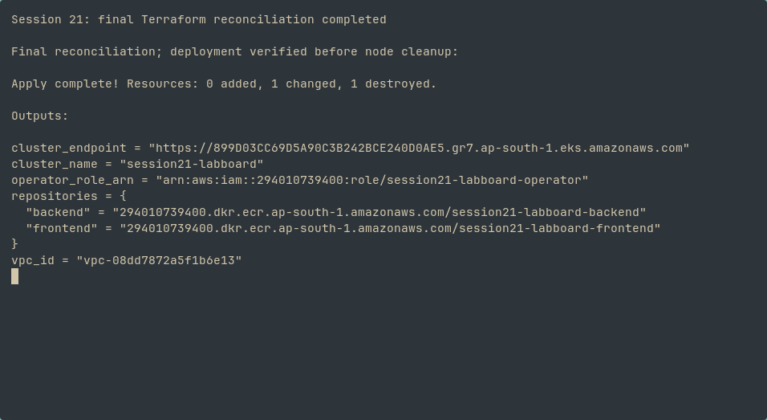
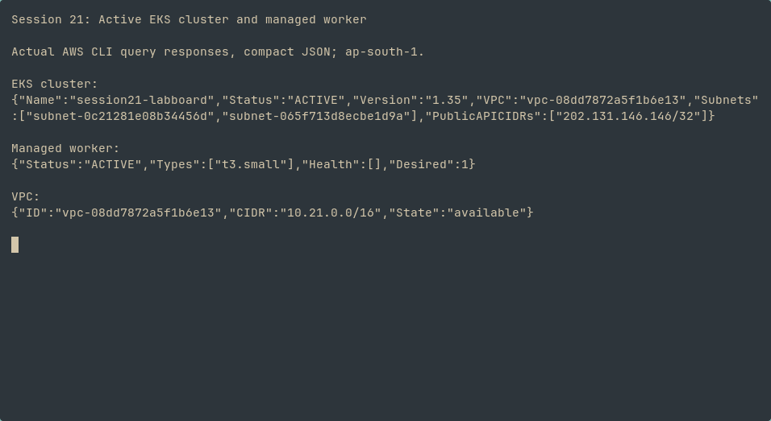
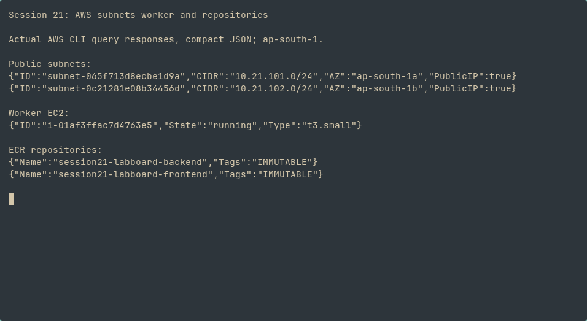
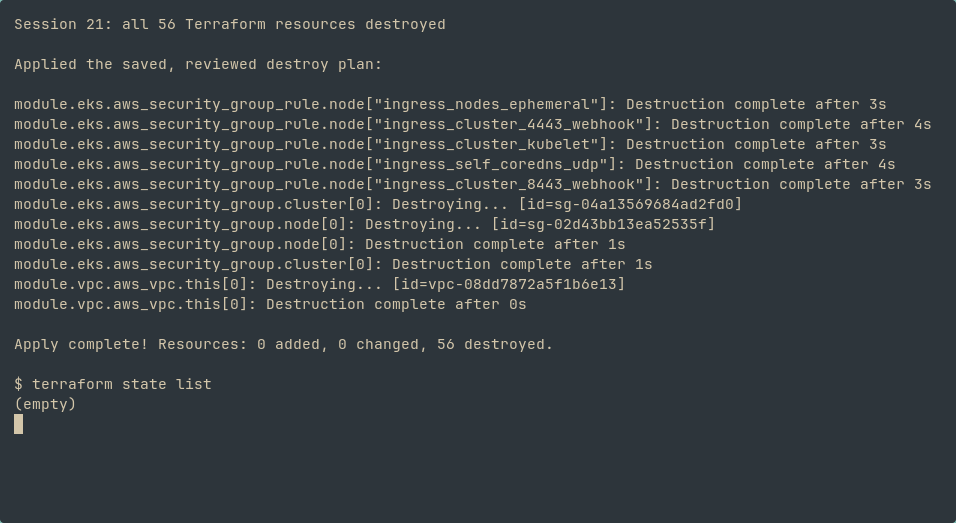

**Cleanup verified:** applying the reviewed destroy plan removed all 56 remaining Terraform resources. `terraform state list` is empty. AWS queries show no lab cluster, VPC or ECR repositories, and both cloud-lab EC2 instances are terminated. The EKS KMS key is `PendingDeletion` until **8 November 2026**, following AWS's deletion window; its key deletion is scheduled rather than immediate.

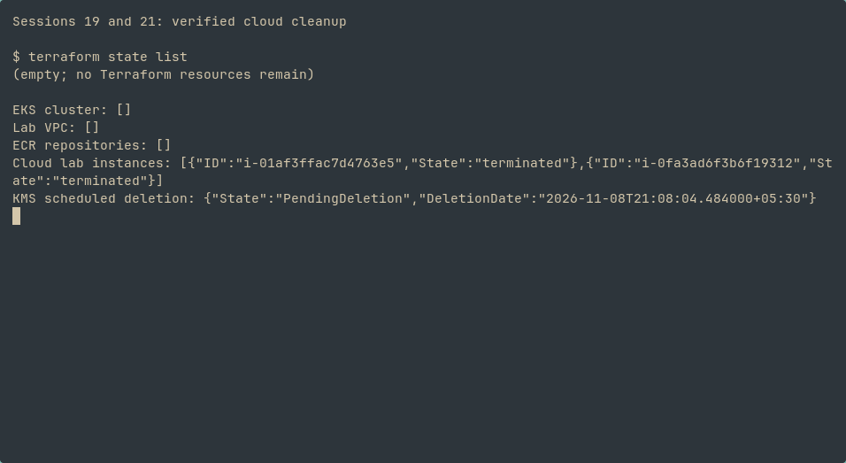

## Monitoring and logs

```bash
helm repo add prometheus-community https://prometheus-community.github.io/helm-charts
helm repo update
helm upgrade --install monitoring prometheus-community/kube-prometheus-stack   --version 92.2.0 --namespace monitoring --create-namespace   -f monitoring/prometheus-values.yaml --wait --timeout 5m
helm upgrade taskboard helm/taskboard -n taskboard --reuse-values   --set monitoring.serviceMonitor.enabled=true
kubectl port-forward -n monitoring svc/monitoring-kube-prometheus-prometheus 19090:9090
# In another terminal:
kubectl port-forward -n monitoring svc/monitoring-grafana 13100:80
kubectl logs -n taskboard deployment/taskboard-taskboard-backend --tail=30
```

Prometheus scrapes `/metrics` through the ServiceMonitor every 15 seconds. Both backend targets were UP with no scrape errors. HTTP counters use route templates to avoid a separate label for every task ID; the histogram records request duration. Process metrics provide CPU time and memory usage.

Open Prometheus at `http://localhost:19090/targets?search=taskboard` and Grafana at `http://localhost:13100/d/labboard/labboard-application-health`. Anonymous Grafana Viewer access is enabled for this disposable local demo through a localhost port-forward. Configure authenticated access before wider exposure.

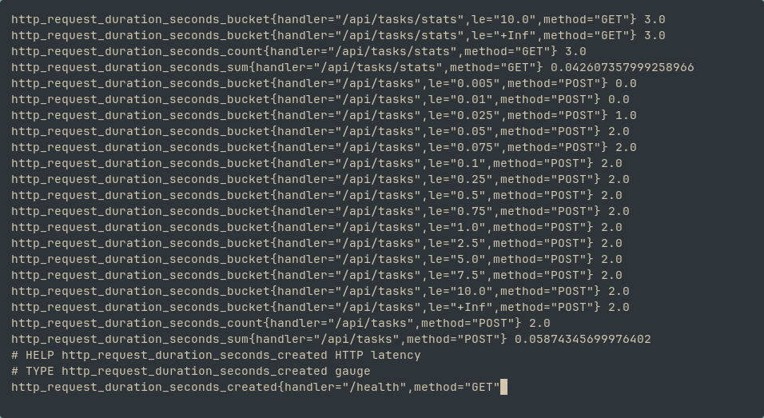
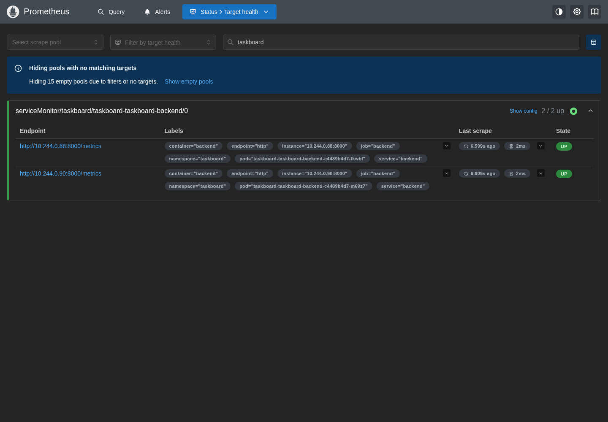
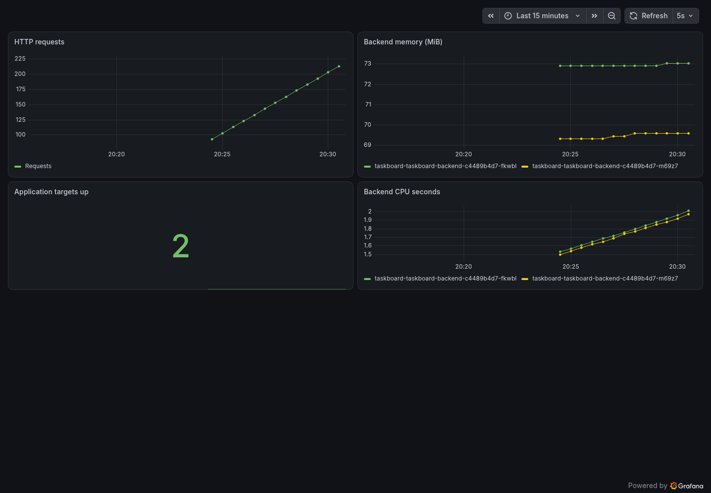

## GitOps demonstration

Argo CD watches the submitted `session21-python` branch and renders the same Helm chart with its base values and `gitops/values.yaml`. [gitops/application.yaml](gitops/application.yaml) enables automatic sync, pruning and self-healing, while respecting the HPA-managed replica field.

```bash
# Argo CD v3.5.4 was installed in namespace argocd for this run.
kubectl apply -f gitops/application.yaml
kubectl get application labboard -n argocd
```

The successful pipeline promoted its SHA image versions to Git. Commit `3508aa3` then changed the replica count from 2 to 3; Argo CD automatically applied it. A manual scale to 1 drifted from Git and self-healed to 3. Commit `e0c1613` restored the final count to 2, and the Application returned to Synced/Healthy. These GitOps commits are separate from the tested image source SHA.

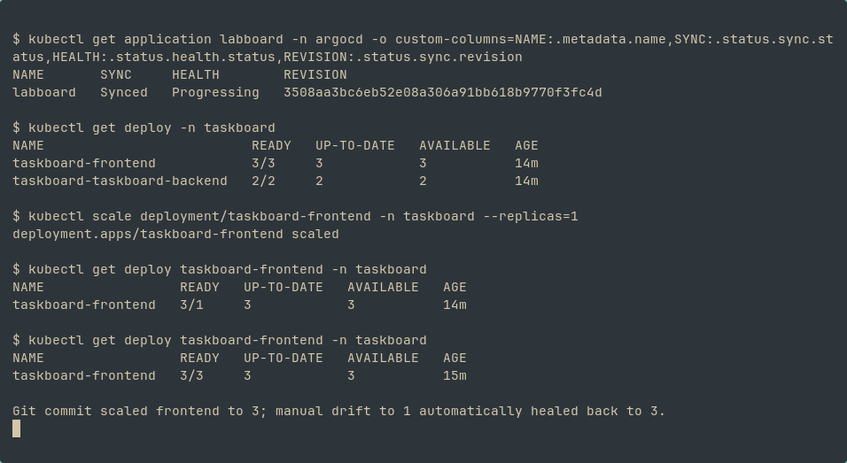

## Final troubleshooting challenge

The supplied broken manifests are intentionally retained for replay. The repairs were applied to their temporary live resources, verified, then those exercise resources were deleted.

| Issue | Investigation and root cause | Repair and verification |
| :-- | :-- | :-- |
| Bad image | Pod status/events showed an image-pull failure; the example GHCR tag does not exist | Replace its pod spec with the working backend spec, including valid image and DB references; rollout completed and pod became Running |
| Empty endpoints | `broken-service` selected `label-that-does-not-exist`; EndpointSlice had no endpoints | Select `app: taskboard-backend`; set targetPort 8000; EndpointSlice contained both pod IPs and `/health` returned UP through the repaired Service |
| AWS worker could not launch | Auto Scaling activity showed Free Tier eligibility rejection | Change Terraform to eligible `t3.small`; node group Active and instance Healthy |
| Stalled AWS authentication | Expired temporary credentials interrupted the original apply | Refresh through a credential process; reconcile the confirmed existing cluster before continuing |

```bash
kubectl apply -f troubleshooting/broken-image.yaml -f troubleshooting/broken-service.yaml
kubectl get pods -n taskboard -l app=broken-image
kubectl get events -n taskboard --sort-by=.lastTimestamp
kubectl get endpointslices -n taskboard -l kubernetes.io/service-name=broken-service
# Inspect and repair the live resources, then remove the exercise objects:
kubectl delete -f troubleshooting/broken-image.yaml -f troubleshooting/broken-service.yaml
```

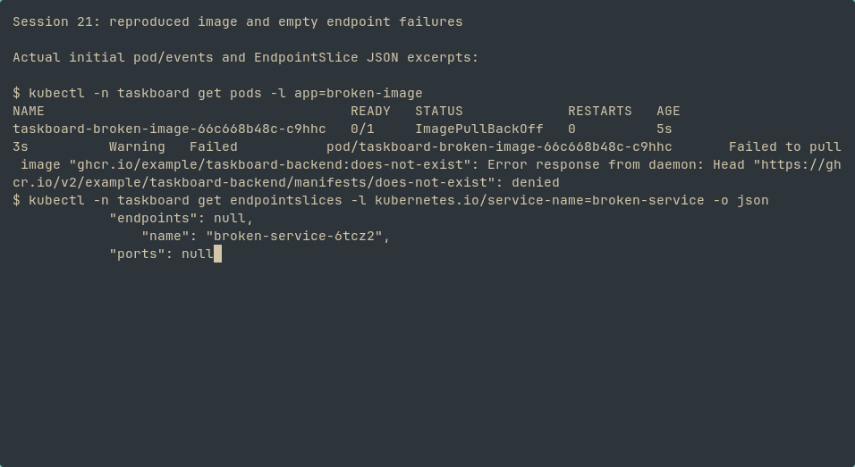
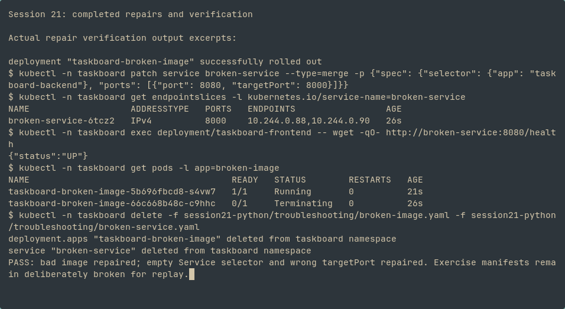

## Lessons learned and demo walkthrough

- Readiness, liveness and database availability answer different questions; the chart and API check each explicitly.
- A Service selector and target port must match the actual pods; Running pods alone do not prove routing works.
- PVC persistence was verified by deleting the database pod, rather than inferred from the manifest.
- Scan dependencies and runtime OS packages; non-root execution and a clean CVE gate provide different protections.
- Keep HPA ownership separate from GitOps replica reconciliation.
- Long cloud operations need refreshable credentials, account-compatible instance types and a retained Terraform state for cleanup.

For the presentation: open the UI, create a lab task, show the ten tests and successful pipeline, show SHA-tagged deployment logs, inspect Kubernetes resources, show the populated metrics dashboard, demonstrate a GitOps replica change, then explain the two repairs and AWS teardown evidence. The screenshots and run above are executed evidence; an instructor presentation is a separate human activity.
