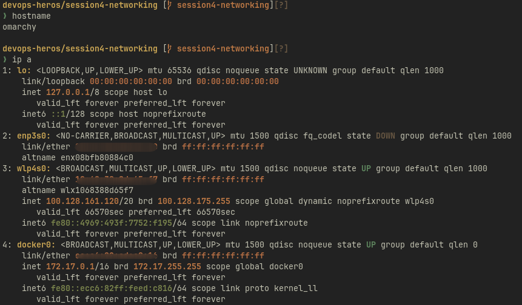
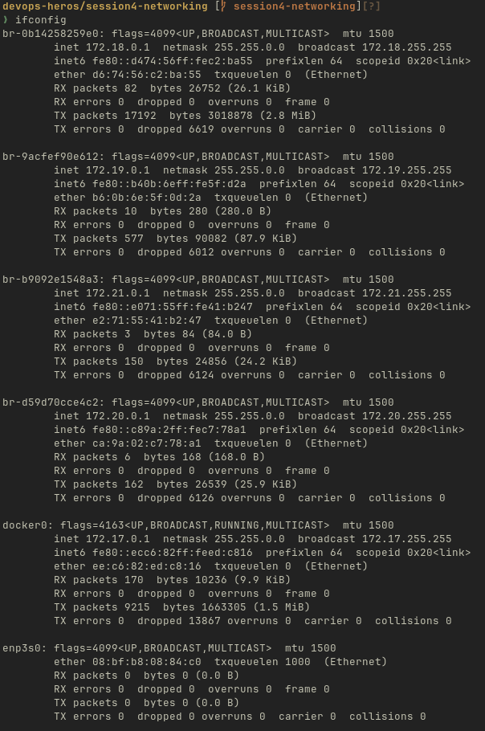
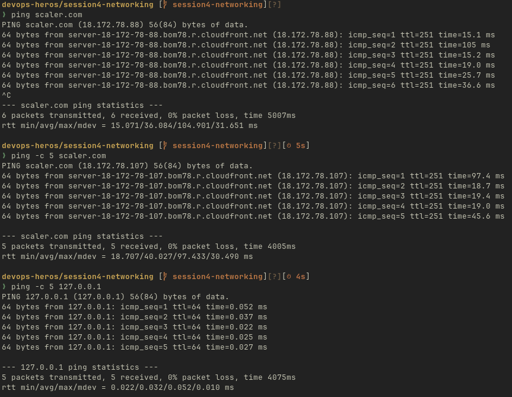
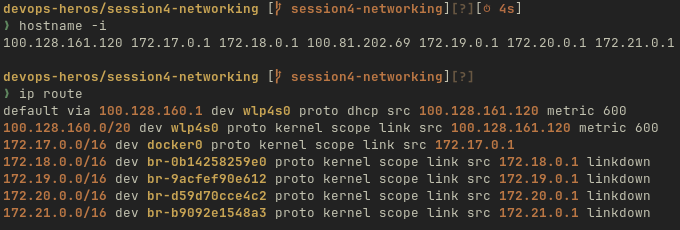
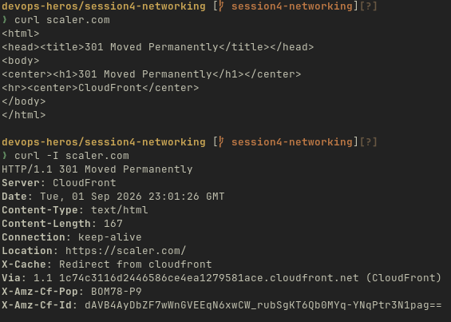
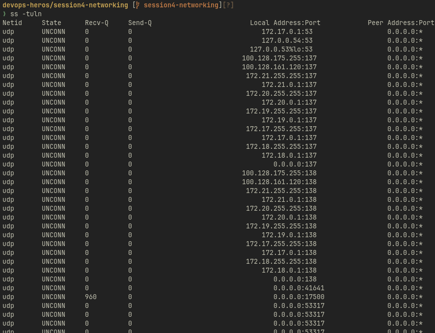
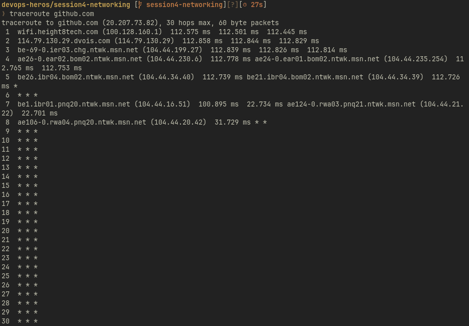

# Networking Commands and Outputs

**`hostname`** — shows my computer's hostname

**`ip a`** — shows network interfaces, IP addresses, MAC addressess and their status

**`ifconfig`** — shows network interface information similar to "ip a"

**`ping scaler.com`** — continuously checks whether scaler.com is reachable and measures response time

**`ping -c 5 scaler.com`** — sends exactly 5 ping packets to scaler.com

**`hostname -i`** — shows the ip address associated with my hostname

**`ip route`** — shows my routing table, including the default gateway

**`curl scaler.com`** — makes an HTTP request and displays the response/content from the website

**`curl -I scaler.com`** — shows only the website's HTTP headers

**`ss -tuln`** — shows listening TCP/UDP ports on my machine

**`traceroute scaler.com`** — shows the network hops/routers my packets pass through to reach github

