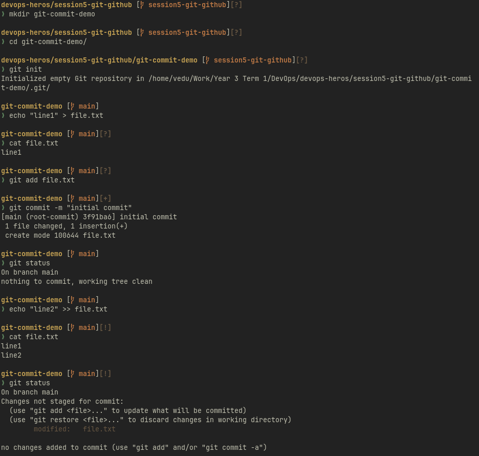
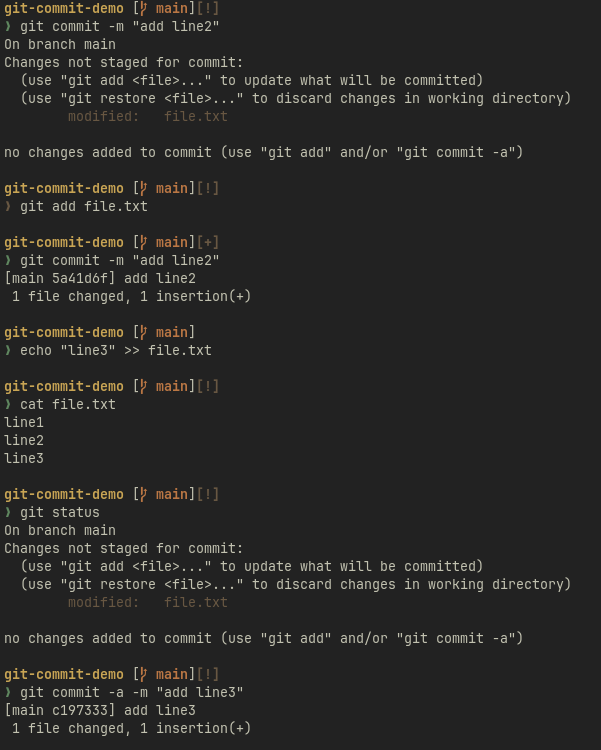
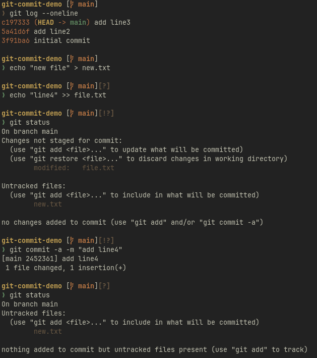

# Task 1

**`git commit -a -m`**

**`-a`** = shortcut for "stage every tracked file that changed, then commit" — saves a git add step, but never picks up brand-new files.

**`git commit -m`** alone commits only what's explicitly staged.

