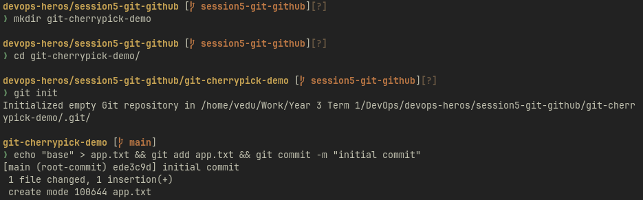
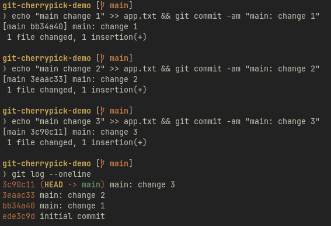
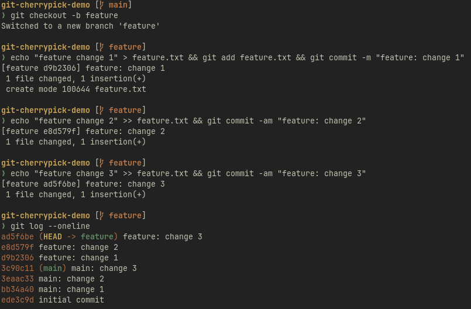
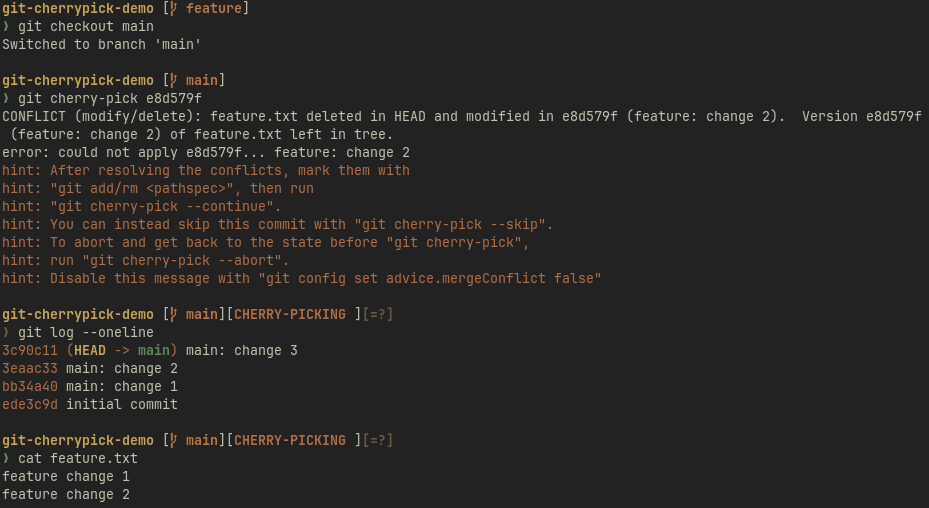

# Task 1

**`git commit -a -m`**

**`-a`** = shortcut for "stage every tracked file that changed, then commit" — saves a git add step, but never picks up brand-new files.

**`git commit -m`** alone commits only what's explicitly staged.

---

# Task 2: Git Cherry-Pick

## Make 2–4 commits on main

## Create a new branch and make commits there

## Identify and cherry-pick one specific commit back into main

**`cherry-pick copies one specific commit's changes onto the current branch as a brand-new commit (different hash, same content/message) — unlike a merge, which brings over the whole branch history.`**

