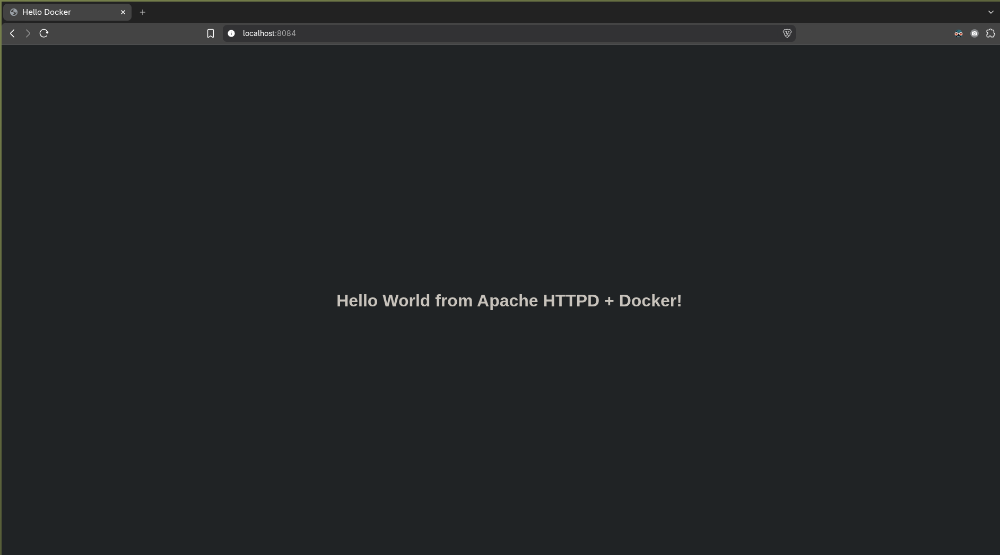
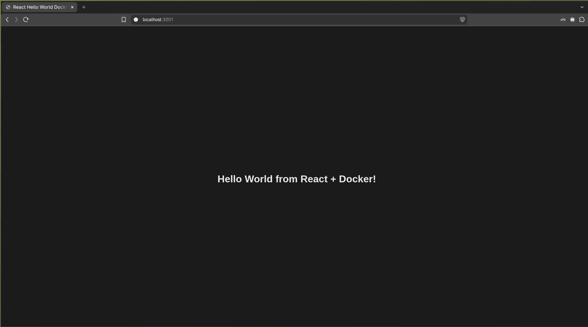
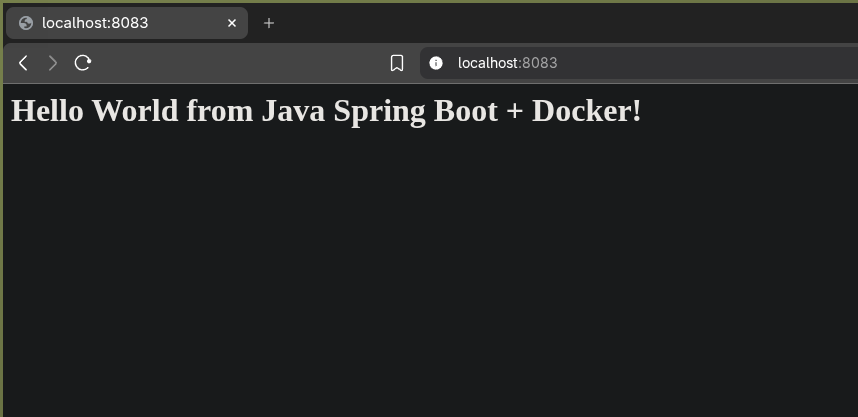
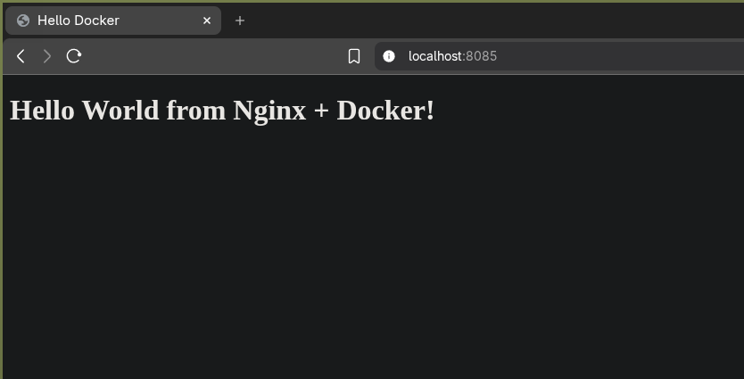
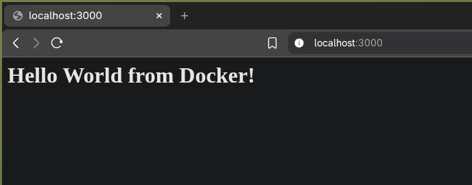
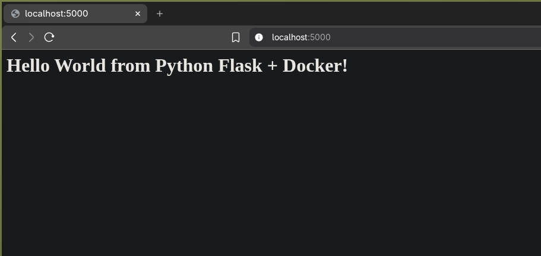

# Apache app

```dockerfile
FROM httpd:alpine

COPY index.html /usr/local/apache2/htdocs/index.html

EXPOSE 80
```



# React app

```dockerfile
# Build stage
FROM node:20-alpine AS builder

WORKDIR /app

COPY package*.json ./
RUN npm install

COPY . .
RUN npm run build

# Production stage
FROM nginx:alpine

COPY --from=builder /app/dist /usr/share/nginx/html

EXPOSE 80

CMD ["nginx", "-g", "daemon off;"]
```



# Java app

```dockerfile
# Build stage
FROM maven:3.9-eclipse-temurin-17 AS builder

WORKDIR /app

COPY pom.xml .
COPY src ./src

RUN mvn clean package -DskipTests

# Runtime stage
FROM eclipse-temurin:17-jre-alpine

WORKDIR /app

COPY --from=builder /app/target/*.jar app.jar

EXPOSE 8080

ENTRYPOINT ["java", "-jar", "app.jar"]
```



# Nginx app

```dockerfile
FROM nginx:alpine

COPY index.html /usr/share/nginx/html/index.html

EXPOSE 80

CMD ["nginx", "-g", "daemon off;"]
```



# Nodejs app

```dockerfile
FROM node:24-alpine

WORKDIR /app

COPY package*.json ./

RUN npm install

COPY . .

EXPOSE 3000

CMD ["npm", "start"]
```



# Python app

```dockerfile
FROM python:3.11-slim

WORKDIR /app

COPY requirements.txt .
RUN pip install --no-cache-dir -r requirements.txt

COPY app.py .

EXPOSE 5000

CMD ["python", "app.py"]
```


