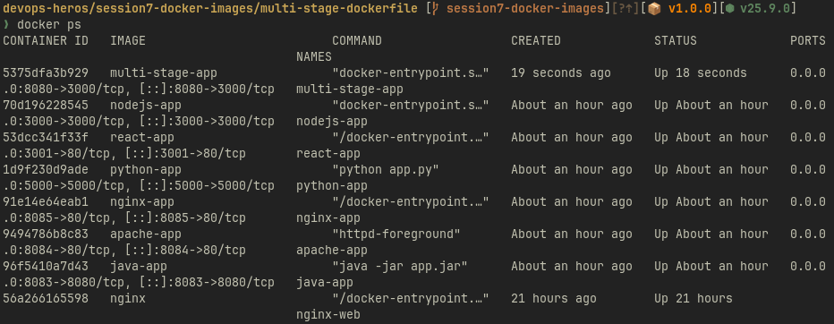
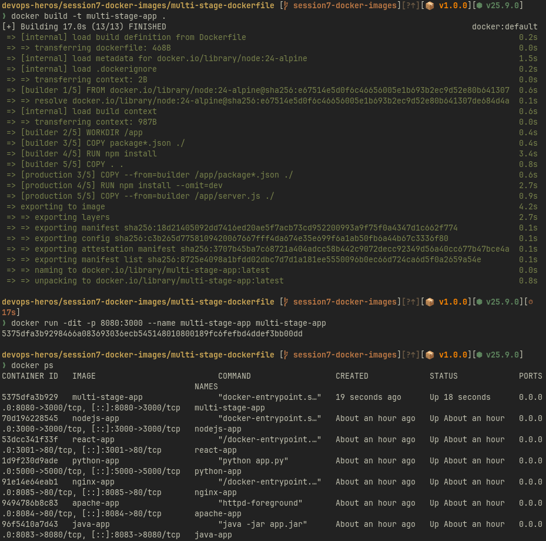
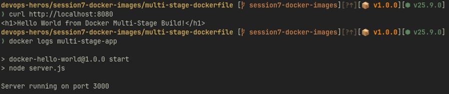
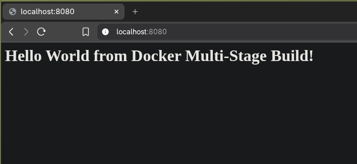
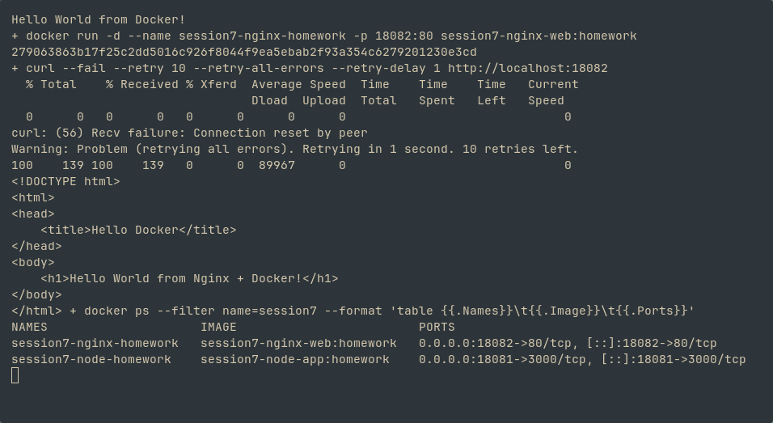

# Name: Vedanshu Nishad

# Roll No.: 24BCS10285

# Task 3: Three Docker application types

Executed on 9 October 2026. All three images built successfully from the existing session directories. The Python Dockerfile was corrected to match its console-only application: it no longer tries to copy a missing requirements file.

| Application | Build | Verification |
| :-- | :-- | :-- |
| Node.js / Express | `docker build -t session7-node-app:homework node-app` | Container on host port 18081 returned `Hello World from Docker!`. |
| Python | `docker build -t session7-python-app:homework python-app` | `docker run --rm session7-python-app:homework` printed `Hello World from Docker!` and exited successfully. |
| Nginx static website | `docker build -t session7-nginx-web:homework nginx-web` | Container on host port 18082 returned `Hello World from Nginx + Docker!`. |

The original multi-stage application evidence above shows the separate required port 8080 deployment. The Python example is a one-shot console program, so it exits rather than appearing among long-running web containers in `docker ps`.
