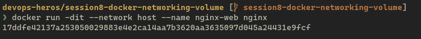
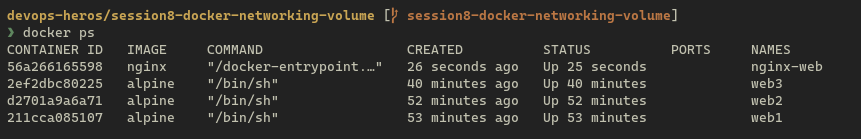
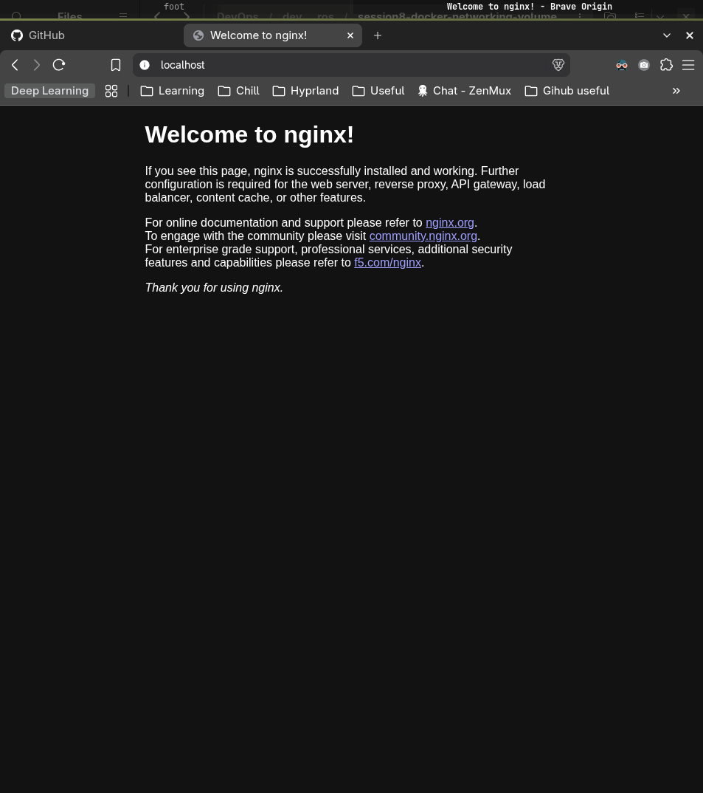
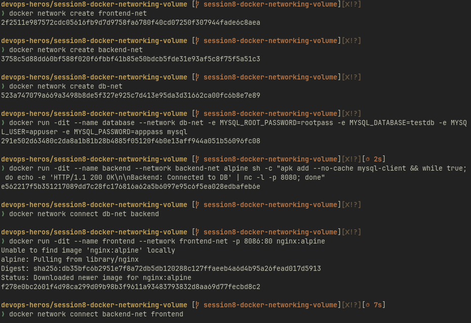
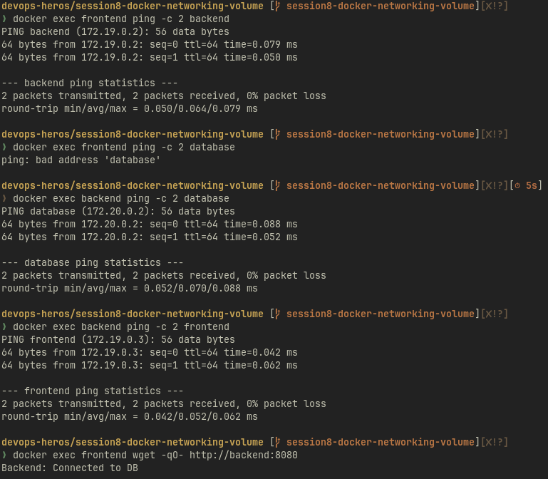
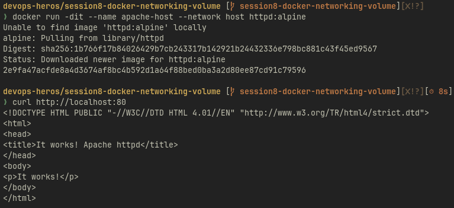
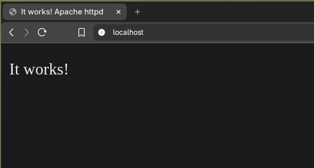
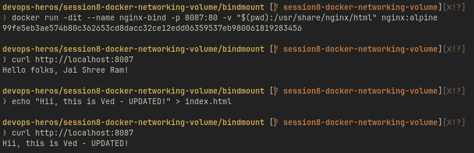
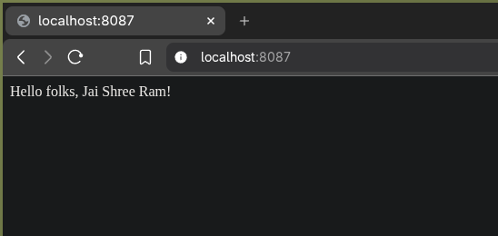
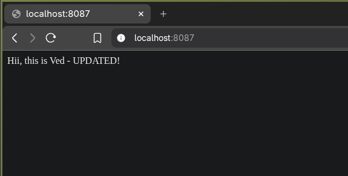

Resources:

- <https://docs.docker.com/engine/network/drivers/>





# Task 1: Docker Container Networking




# Task 2: Host Network




# Task 3: Bind Mount





# Task 4: Overlay Network

An **overlay network** connects containers on different Docker hosts. They share
a logical network even though they run on separate machines.

## When it is useful

For example, a frontend on host A can communicate with a backend on host B.
Overlay networks are useful for Docker Swarm applications spread across hosts.
A bridge network normally connects containers on a single host.

## How it works

Docker uses **VXLAN (Virtual Extensible LAN)**, which wraps container traffic inside packets that can
travel between hosts. The destination host delivers the traffic to its container.

```text
Host A: frontend -> VXLAN over host network -> Host B: backend
        \____________ same overlay network ____________/
```

Participating hosts must join the same Swarm. An **attachable** overlay allows
standalone containers to join, as well as Swarm services. Both endpoints must
belong to the same overlay to communicate through it.

The default host-to-host ports are TCP 2377 for Swarm management, TCP/UDP 7946
for node communication, and UDP 4789 for overlay traffic. Application traffic
encryption is optional; it requires enabling the encrypted network option.

This task is research; the diagram describes how overlays work.
[Source: Docker overlay driver](https://docs.docker.com/engine/network/drivers/overlay/).
