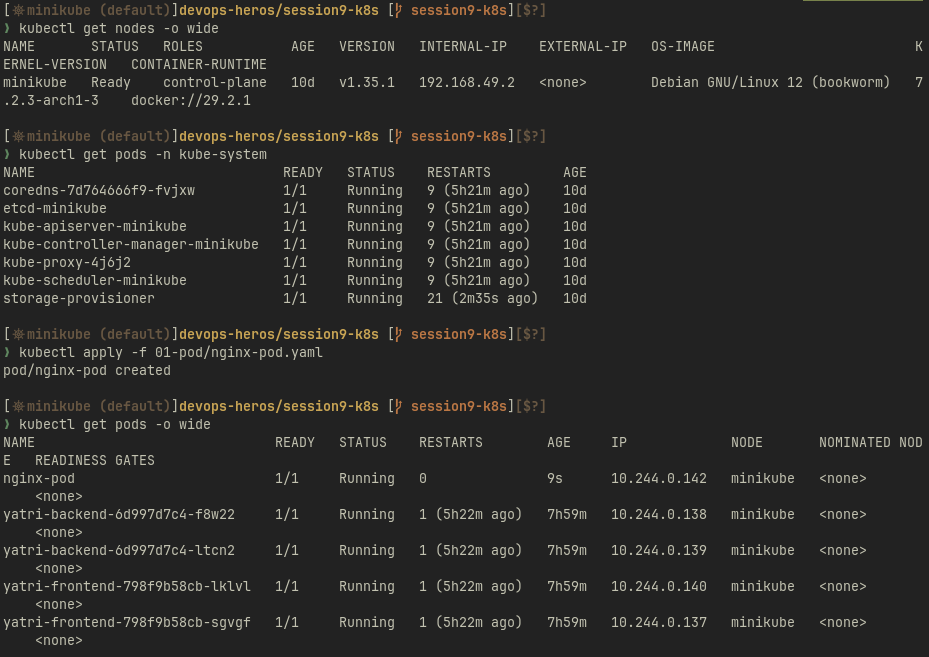
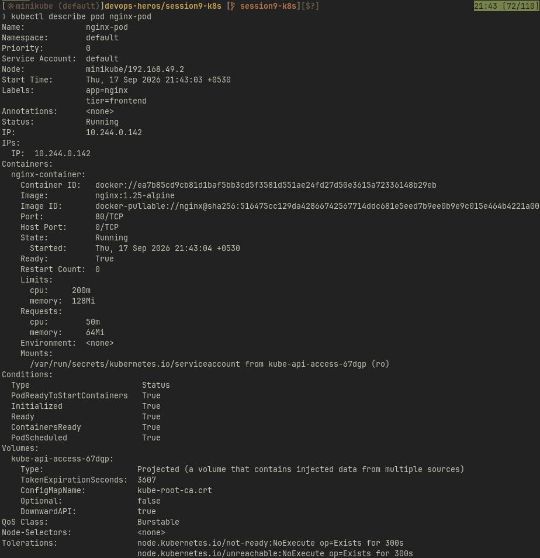
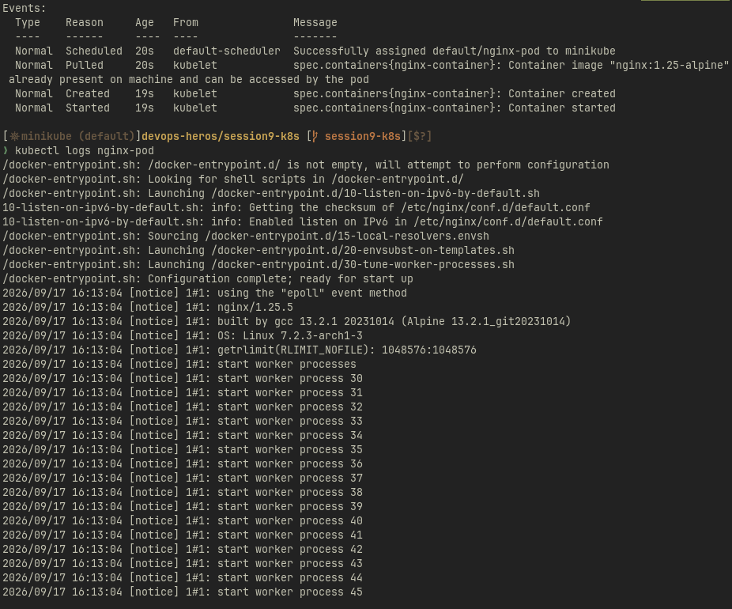
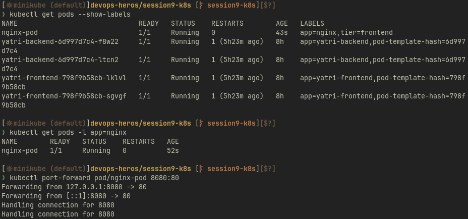
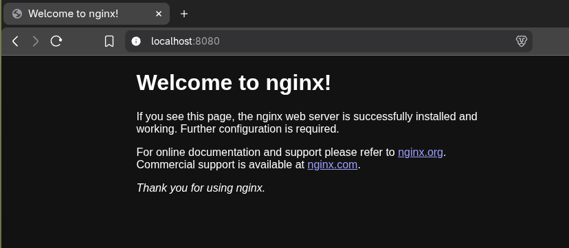
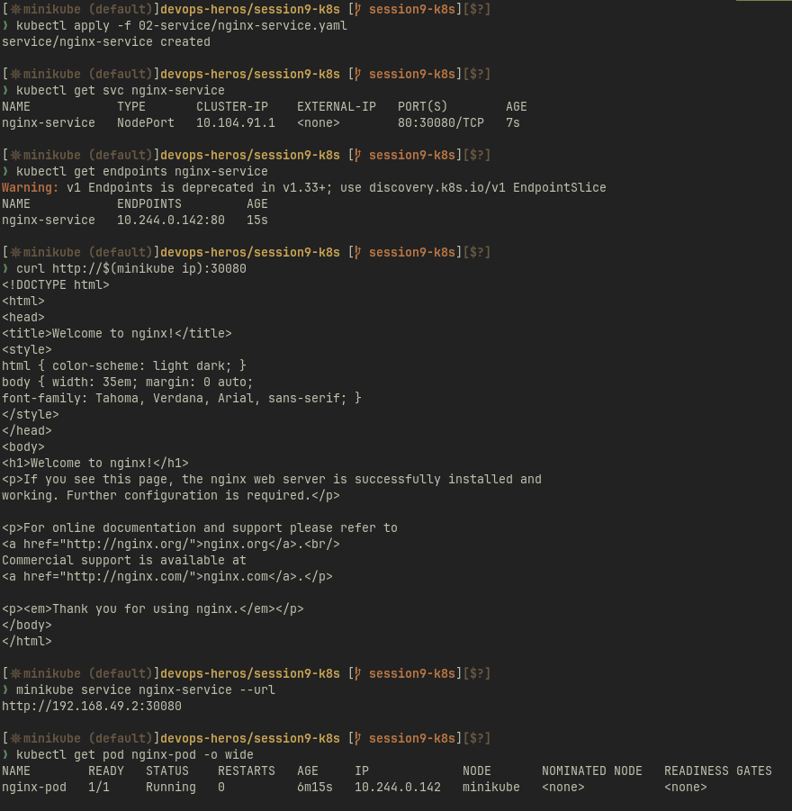
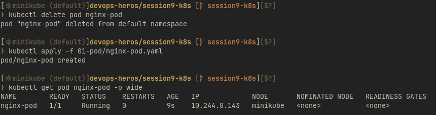
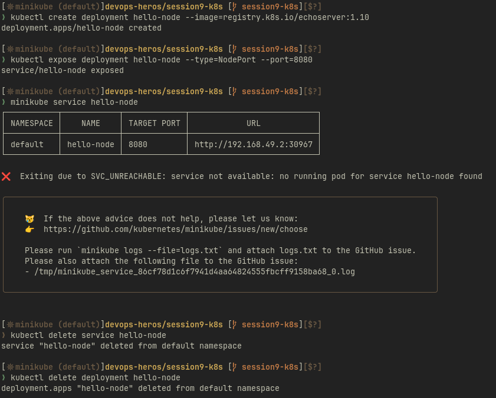

# Resources

- <https://kubernetes.io/docs/tutorials/kubernetes-basics/>
- <https://minikube.sigs.k8s.io/docs/start/?arch=%2Fmacos%2Farm64%2Fstable%2Fbinary+download>

- <https://kubernetes.io/docs/concepts/architecture/>

- <https://github.com/Nency-Ravaliya/Kubernetes>

# 01-pod

# 02-service

# minikube

