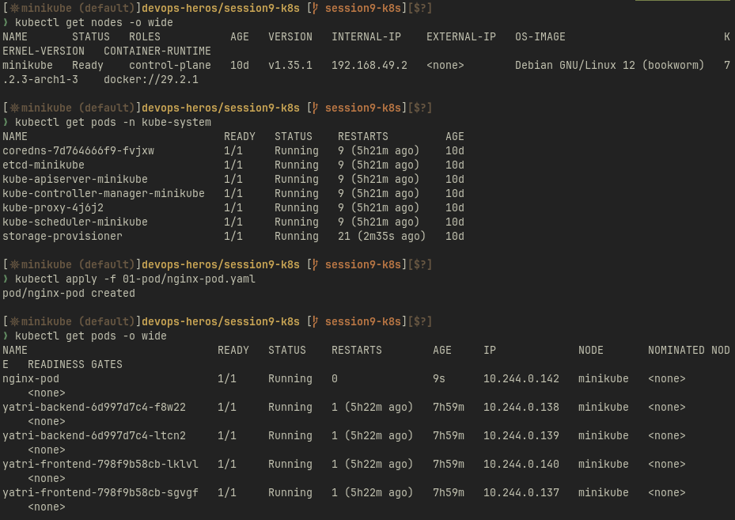
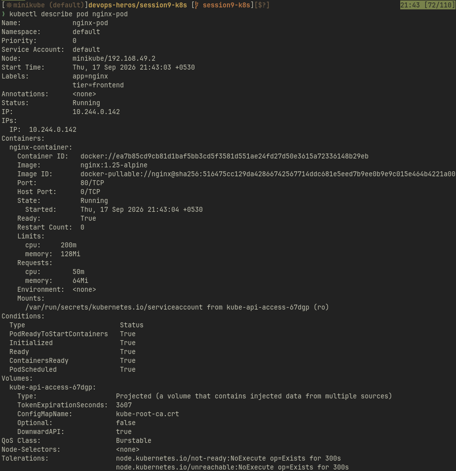
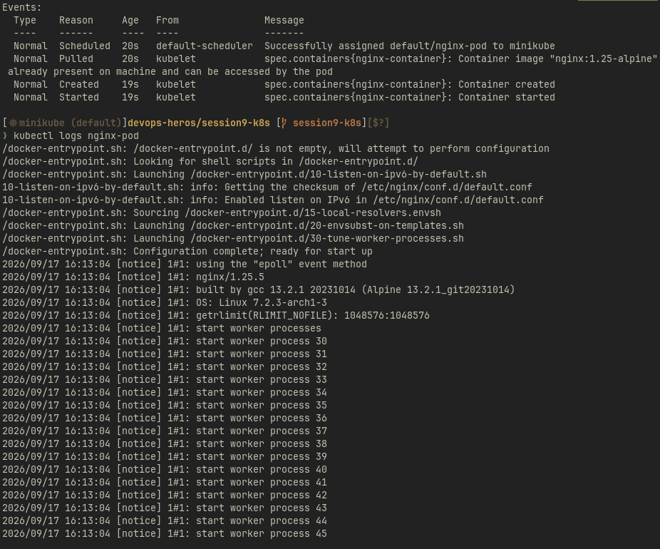
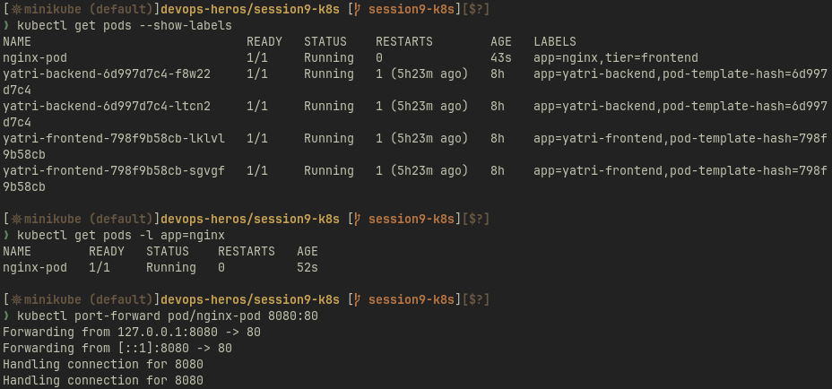
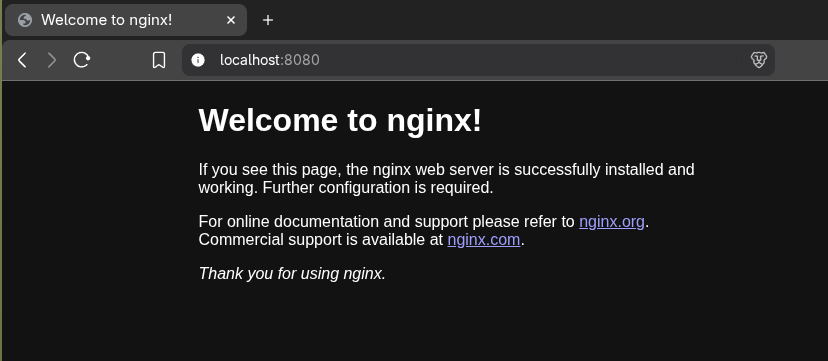
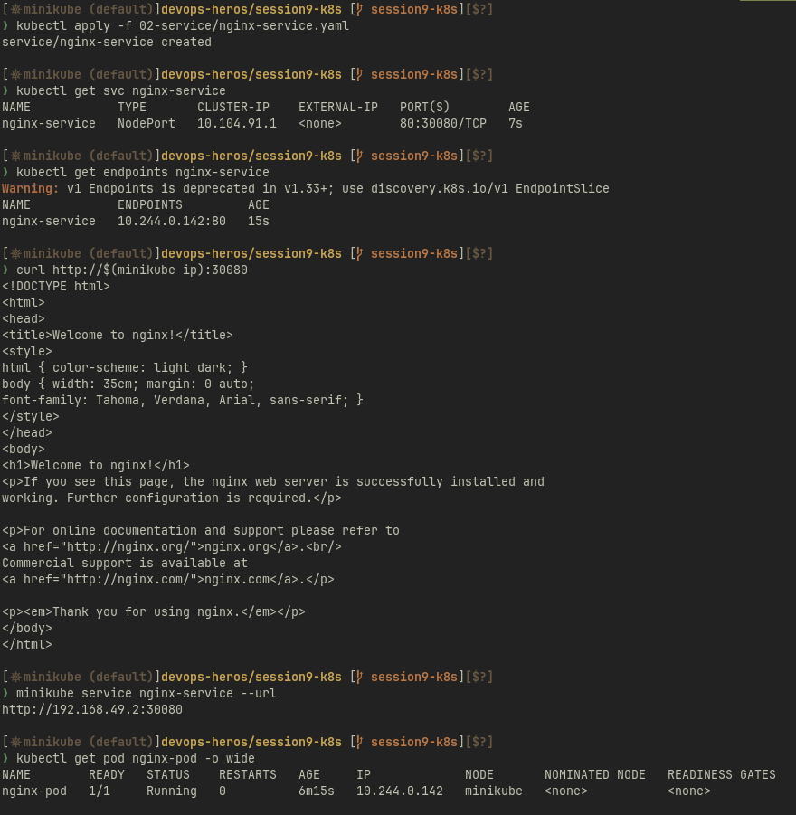
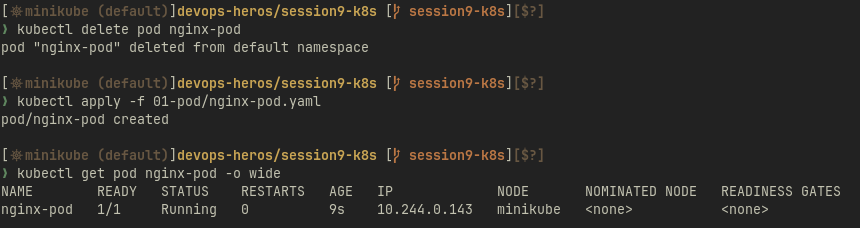
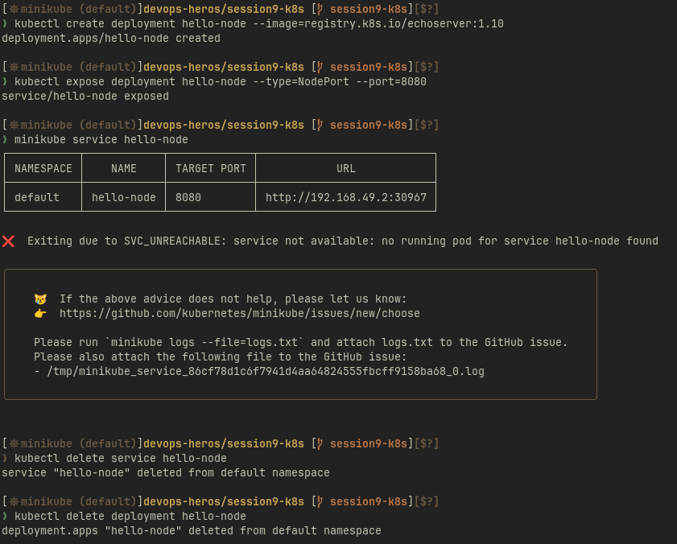

# Resources

- <https://kubernetes.io/docs/tutorials/kubernetes-basics/>
- <https://minikube.sigs.k8s.io/docs/start/?arch=%2Fmacos%2Farm64%2Fstable%2Fbinary+download>

- <https://kubernetes.io/docs/concepts/architecture/>

- <https://github.com/Nency-Ravaliya/Kubernetes>

# 01-pod







# 02-service




# minikube



# Kubernetes Architecture

Kubernetes has a **control plane** that manages the cluster and **worker nodes**
that run applications. A **Pod** is its smallest deployable unit and contains one
or more containers.

## Control plane

| Component | Job |
| --- | --- |
| API server | Receives requests from `kubectl` and other components. |
| etcd | Stores cluster configuration and state. |
| Scheduler | Chooses a suitable node for each unscheduled Pod. |
| Controller manager | Runs controllers that keep actual state close to desired state. |

## Worker node

| Component | Job |
| --- | --- |
| kubelet | Ensures the node's assigned Pods have running containers. |
| Container runtime | Starts and stops containers, for example using containerd. |
| Service networking | Routes Service traffic; commonly implemented by kube-proxy. |

The CNI (Container Network Interface) plugin provides Pod networking. CoreDNS
provides cluster DNS.

## Example: requesting two application replicas

```text
kubectl -> API server -> stored desired state
              |
       Deployment controller -> ReplicaSet -> two Pods
                                             |
                                    Scheduler chooses nodes
                                             |
                               kubelet + runtime run containers
```

Controllers replace deleted managed Pods to restore the desired replica count.
The default single-node Minikube setup combines control-plane and worker roles.
[Source: Kubernetes architecture](https://kubernetes.io/docs/concepts/architecture/).
