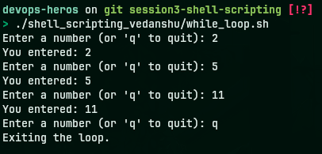

# Shell Scripting — Session 3

**Vedanshu Nishad** — 24BCS10285 — Batch B

## Outputs

### task.sh

### input.sh

### condition.sh

### loop.sh

### loop_task.sh

### loop_task_while.sh

### while_loop.sh

It repeatedly takes input, quits on q, rejects non-numbers, and prints valid numbers until you quit.

### function.sh

